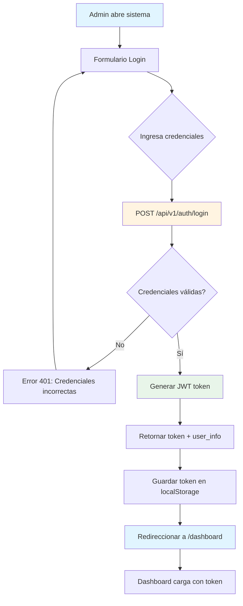
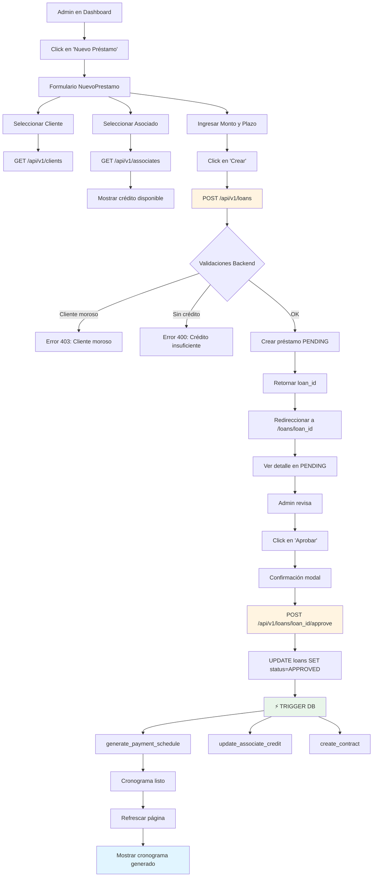
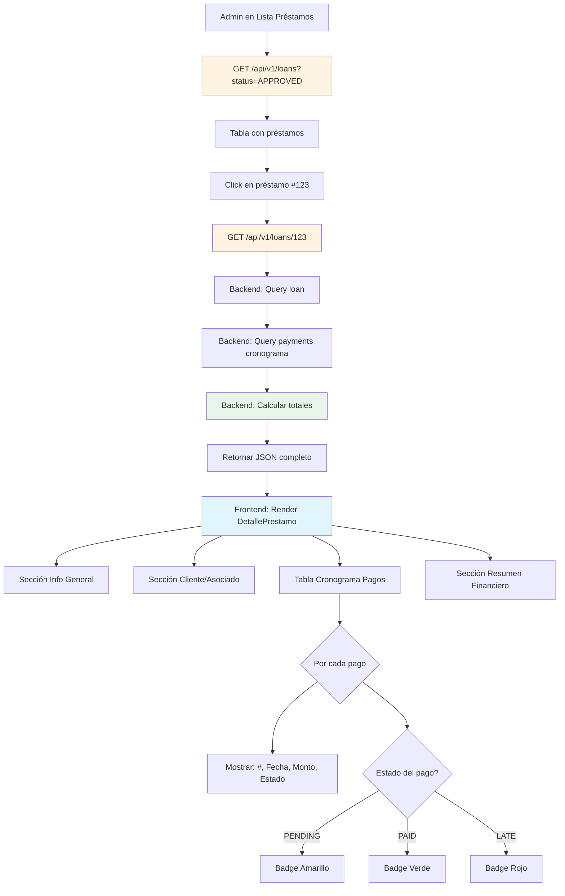

# 📋 PLAN MAESTRO - CREDINET V2.0

**Objetivo:** Definir EXACTAMENTE qué construir antes de escribir código  
**Fecha:** 30 de Octubre, 2025  
**Versión:** 2.0.0

---

## 🎯 METODOLOGÍA

```
1. USER STORIES (QUÉ necesita cada actor)
   ↓
2. DIAGRAMAS DE FLUJO (CÓMO se ejecuta cada historia)
   ↓
3. ENDPOINTS API (QUÉ necesita el frontend)
   ↓
4. WIREFRAMES UI (CÓMO se ve para el usuario)
   ↓
5. IMPLEMENTACIÓN (Backend + Frontend)
```

**Beneficios:**
- ✅ No reescribimos código
- ✅ Frontend y Backend alineados desde el inicio
- ✅ Prioridades claras (MVP vs Nice-to-Have)
- ✅ Testing definido desde diseño
- ✅ Documentación automática (los diagramas SON la doc)

---

## 👥 ACTORES DEL SISTEMA

### 1. Admin (Rol: `administrador`)
**Usuario actual del sistema - Maneja TODO**

**Necesidades:**
- Crear préstamos a nombre de clientes
- Aprobar/rechazar préstamos
- Registrar pagos de clientes
- Cerrar períodos quincenales
- Ver reportes de morosidad
- Gestionar asociados

### 2. Asociado (Rol: `asociado`)
**Futuro - Por ahora admin lo opera**

**Necesidades (futuras):**
- Ver su cartera de clientes
- Ver su crédito disponible
- Reportar pagos cobrados

### 3. Cliente (Rol: `cliente`)
**Futuro - Por ahora admin lo registra**

**Necesidades (futuras):**
- Ver su préstamo activo
- Ver cronograma de pagos
- Descargar contrato

---

## 📊 PRIORIZACIÓN: MVP vs FUTURO

### 🔴 FASE 1 - MVP (CRÍTICO - Implementar YA)

**Para que el admin pueda operar el sistema básico:**

1. ✅ **Autenticación**
   - Login como admin
   - JWT tokens

2. ✅ **Gestión de Préstamos**
   - Crear préstamo (admin a nombre de cliente)
   - Aprobar préstamo (genera cronograma automático)
   - Ver lista de préstamos
   - Ver detalle de préstamo con cronograma

3. ✅ **Gestión de Asociados**
   - Listar asociados
   - Ver crédito disponible de asociado
   - Crear/editar asociado

4. ✅ **Consultas Básicas**
   - Ver cronograma de pagos de un préstamo
   - Ver préstamos pendientes de aprobación
   - Dashboard con métricas básicas

### 🟡 FASE 2 - OPERACIÓN COMPLETA (Después del MVP)

5. ⏳ **Registro de Pagos**
   - Registrar que cliente pagó quincena
   - Ver historial de pagos

6. ⏳ **Períodos de Corte**
   - Cerrar período quincenal
   - Ver períodos anteriores

7. ⏳ **Sistema de Morosidad**
   - Reportar cliente moroso
   - Crear convenios

### 🟢 FASE 3 - AUTOMATIZACIÓN (Largo plazo)

8. 🔮 **Portal Asociado**
   - Login como asociado
   - Reportar pagos cobrados

9. 🔮 **Portal Cliente**
   - Login como cliente
   - Ver su préstamo

10. 🔮 **Reportes Avanzados**
    - Exportar a Excel
    - Gráficas de rendimiento

---

## 🎭 USER STORIES - FASE 1 (MVP)

### Epic 1: Autenticación y Seguridad

#### US-1.1: Login Admin
```
COMO admin
QUIERO iniciar sesión con mi usuario y contraseña
PARA acceder al sistema de forma segura

CRITERIOS DE ACEPTACIÓN:
- [ ] Formulario con username y password
- [ ] Validación de credenciales contra DB
- [ ] Generación de JWT token
- [ ] Redirección a dashboard si login exitoso
- [ ] Mensaje de error si credenciales incorrectas
- [ ] Token expira en 30 minutos

PRIORIDAD: 🔴 CRÍTICA
ESTIMACIÓN: 2 horas
```

#### US-1.2: Protección de Rutas
```
COMO sistema
QUIERO validar JWT en cada request
PARA asegurar que solo usuarios autenticados accedan

CRITERIOS DE ACEPTACIÓN:
- [ ] Middleware valida token en header Authorization
- [ ] Retorna 401 si token inválido o expirado
- [ ] Retorna 403 si rol no tiene permisos
- [ ] Token incluye user_id y role

PRIORIDAD: 🔴 CRÍTICA
ESTIMACIÓN: 1 hora
```

---

### Epic 2: Gestión de Préstamos

#### US-2.1: Crear Solicitud de Préstamo
```
COMO admin
QUIERO crear una solicitud de préstamo a nombre de un cliente
PARA registrar su petición de crédito

CRITERIOS DE ACEPTACIÓN:
- [ ] Formulario con: cliente, asociado, monto, plazo (quincenas)
- [ ] Dropdown de clientes existentes
- [ ] Dropdown de asociados disponibles
- [ ] Validación: cliente no moroso
- [ ] Validación: asociado tiene crédito disponible
- [ ] Préstamo se crea con status PENDING
- [ ] Mensaje de éxito con ID del préstamo
- [ ] Redirección a lista de préstamos pendientes

PRIORIDAD: 🔴 CRÍTICA
ESTIMACIÓN: 4 horas
PANTALLA: FormularioNuevoPrestamo.tsx
```

#### US-2.2: Aprobar Préstamo
```
COMO admin
QUIERO aprobar un préstamo pendiente
PARA activarlo y generar su cronograma de pagos

CRITERIOS DE ACEPTACIÓN:
- [ ] Botón "Aprobar" en detalle de préstamo pendiente
- [ ] Confirmación: "¿Aprobar préstamo por $X a ClienteY?"
- [ ] Al aprobar: status cambia a APPROVED
- [ ] DB automáticamente genera cronograma (trigger)
- [ ] DB automáticamente actualiza crédito del asociado
- [ ] Mostrar cronograma generado
- [ ] Enviar notificación (futuro)

PRIORIDAD: 🔴 CRÍTICA
ESTIMACIÓN: 3 horas
PANTALLA: DetallePrestamo.tsx
```

#### US-2.3: Ver Lista de Préstamos
```
COMO admin
QUIERO ver la lista de todos los préstamos
PARA gestionarlos fácilmente

CRITERIOS DE ACEPTACIÓN:
- [ ] Tabla con: ID, Cliente, Asociado, Monto, Estado, Fecha
- [ ] Filtros por: Estado (Pendiente/Aprobado/Rechazado/Activo)
- [ ] Búsqueda por nombre de cliente
- [ ] Paginación (20 por página)
- [ ] Ordenar por fecha (más reciente primero)
- [ ] Click en fila abre detalle

PRIORIDAD: 🔴 CRÍTICA
ESTIMACIÓN: 3 horas
PANTALLA: ListaPrestamos.tsx
```

#### US-2.4: Ver Detalle de Préstamo
```
COMO admin
QUIERO ver el detalle completo de un préstamo
PARA revisar su estado y cronograma

CRITERIOS DE ACEPTACIÓN:
- [ ] Info del préstamo: Monto, Plazo, Interés, Comisión
- [ ] Info del cliente: Nombre, Teléfono, Asociado
- [ ] Cronograma de pagos: Quincena, Fecha vencimiento, Monto, Estado
- [ ] Resumen: Total a pagar, Pagado, Pendiente
- [ ] Botones de acción según estado (Aprobar/Rechazar si pending)
- [ ] Descargar contrato (PDF) si aprobado

PRIORIDAD: 🔴 CRÍTICA
ESTIMACIÓN: 4 horas
PANTALLA: DetallePrestamo.tsx
```

---

### Epic 3: Gestión de Asociados

#### US-3.1: Ver Lista de Asociados
```
COMO admin
QUIERO ver la lista de asociados
PARA conocer su estado y crédito

CRITERIOS DE ACEPTACIÓN:
- [ ] Tabla con: Nombre, Nivel, Crédito Límite, Usado, Disponible
- [ ] Badge de color por nivel (Bronce/Plata/Oro/Platino/Diamante)
- [ ] Indicador visual si crédito bajo (<20%)
- [ ] Búsqueda por nombre
- [ ] Click en fila abre detalle

PRIORIDAD: 🔴 CRÍTICA
ESTIMACIÓN: 2 horas
PANTALLA: ListaAsociados.tsx
```

#### US-3.2: Ver Detalle de Asociado
```
COMO admin
QUIERO ver el detalle de un asociado
PARA analizar su cartera y rendimiento

CRITERIOS DE ACEPTACIÓN:
- [ ] Info del asociado: Nombre, Email, Teléfono, Nivel
- [ ] Crédito: Límite, Usado, Disponible (con % y barra visual)
- [ ] Lista de préstamos activos de su cartera
- [ ] Métricas: Total prestado, Total recuperado, Morosidad
- [ ] Historial de cambios de nivel

PRIORIDAD: 🟡 ALTA
ESTIMACIÓN: 3 horas
PANTALLA: DetalleAsociado.tsx
```

---

### Epic 4: Dashboard y Métricas

#### US-4.1: Dashboard Admin
```
COMO admin
QUIERO ver un dashboard con métricas clave
PARA tener visión general del sistema

CRITERIOS DE ACEPTACIÓN:
- [ ] Cards con:
  - Total préstamos activos
  - Monto total prestado
  - Préstamos pendientes de aprobación
  - Clientes morosos
- [ ] Lista de "Tareas Pendientes":
  - Préstamos por aprobar
  - Períodos por cerrar
- [ ] Gráfica simple de préstamos por mes (últimos 6 meses)

PRIORIDAD: 🟡 ALTA
ESTIMACIÓN: 4 horas
PANTALLA: Dashboard.tsx
```

---

## 🔄 DIAGRAMAS DE FLUJO (Mermaid)

### FLUJO 1: Login Admin



### FLUJO 2: Crear y Aprobar Préstamo



### FLUJO 3: Consultar Préstamo con Cronograma



---

## 🌐 API REST - ESPECIFICACIÓN COMPLETA

### Base URL
```
http://localhost:8000/api/v1
```

### Autenticación
Todos los endpoints (excepto `/auth/login`) requieren:
```
Headers:
  Authorization: Bearer {JWT_TOKEN}
```

---

### 🔐 Módulo: AUTH

#### `POST /auth/login`
**Descripción:** Autenticar usuario y obtener JWT token

**Request:**
```json
{
  "username": "admin",
  "password": "admin123"
}
```

**Response 200:**
```json
{
  "access_token": "eyJhbGciOiJIUzI1NiIs...",
  "token_type": "bearer",
  "user": {
    "id": 2,
    "username": "admin",
    "full_name": "Administrador",
    "role": "administrador"
  }
}
```

**Errors:**
- `401`: Credenciales incorrectas
- `422`: Validación fallida

---

### 💰 Módulo: LOANS

#### `GET /loans`
**Descripción:** Listar préstamos con filtros

**Query Params:**
```
?status=PENDING           # Opcional: PENDING|APPROVED|REJECTED|ACTIVE|COMPLETED
&associate_id=3           # Opcional: Filtrar por asociado
&client_id=5              # Opcional: Filtrar por cliente
&page=1                   # Default: 1
&page_size=20             # Default: 20
```

**Response 200:**
```json
{
  "total": 45,
  "page": 1,
  "page_size": 20,
  "items": [
    {
      "id": 123,
      "user_id": 5,
      "user_name": "Sofía Vargas",
      "associate_id": 3,
      "associate_name": "Asociado Test",
      "amount": 100000.00,
      "term_biweeks": 12,
      "status_id": 2,
      "status_name": "APPROVED",
      "created_at": "2025-01-05T10:30:00Z",
      "approved_at": "2025-01-06T14:20:00Z"
    }
  ]
}
```

---

#### `GET /loans/{loan_id}`
**Descripción:** Obtener detalle completo de un préstamo

**Response 200:**
```json
{
  "id": 123,
  "user_id": 5,
  "user": {
    "id": 5,
    "full_name": "Sofía Vargas",
    "email": "sofia@example.com",
    "phone": "5551234567",
    "is_defaulter": false
  },
  "associate_id": 3,
  "associate": {
    "id": 3,
    "full_name": "Asociado Test",
    "level_name": "Oro",
    "credit_available": 150000.00
  },
  "amount": 100000.00,
  "term_biweeks": 12,
  "interest_rate": 2.5,
  "commission_rate": 2.5,
  "total_amount": 105000.00,
  "status_id": 2,
  "status_name": "APPROVED",
  "created_at": "2025-01-05T10:30:00Z",
  "approved_at": "2025-01-06T14:20:00Z",
  "approved_by": 2,
  "contract_id": 45,
  "payments": [
    {
      "id": 1001,
      "payment_number": 1,
      "payment_due_date": "2025-01-15",
      "amount_due": 8750.00,
      "amount_paid": 8750.00,
      "payment_date": "2025-01-15",
      "status_id": 3,
      "status_name": "PAID",
      "is_late": false
    },
    {
      "id": 1002,
      "payment_number": 2,
      "payment_due_date": "2025-01-31",
      "amount_due": 8750.00,
      "amount_paid": null,
      "payment_date": null,
      "status_id": 1,
      "status_name": "PENDING",
      "is_late": false
    }
  ],
  "summary": {
    "total_due": 105000.00,
    "total_paid": 8750.00,
    "total_pending": 96250.00,
    "percent_paid": 8.33,
    "payments_completed": 1,
    "payments_total": 12
  }
}
```

**Errors:**
- `404`: Préstamo no encontrado
- `403`: Sin permisos para ver este préstamo

---

#### `POST /loans`
**Descripción:** Crear solicitud de préstamo

**Request:**
```json
{
  "user_id": 5,
  "associate_id": 3,
  "amount": 100000.00,
  "term_biweeks": 12,
  "interest_rate": 2.5,      # Opcional (usa default)
  "commission_rate": 2.5     # Opcional (usa default)
}
```

**Response 201:**
```json
{
  "id": 123,
  "user_id": 5,
  "associate_id": 3,
  "amount": 100000.00,
  "term_biweeks": 12,
  "status_id": 1,
  "status_name": "PENDING",
  "created_at": "2025-01-05T10:30:00Z",
  "created_by": 2
}
```

**Errors:**
- `400`: Validación fallida
- `403`: Cliente es moroso
- `400`: Asociado sin crédito suficiente

---

#### `POST /loans/{loan_id}/approve`
**Descripción:** Aprobar préstamo (genera cronograma automáticamente)

**Request:** (vacío)

**Response 200:**
```json
{
  "id": 123,
  "status_id": 2,
  "status_name": "APPROVED",
  "approved_at": "2025-01-06T14:20:00Z",
  "approved_by": 2,
  "message": "Préstamo aprobado. Cronograma de 12 pagos generado automáticamente."
}
```

**Errors:**
- `400`: Préstamo ya procesado
- `403`: Sin permisos para aprobar
- `404`: Préstamo no encontrado

---

#### `POST /loans/{loan_id}/reject`
**Descripción:** Rechazar préstamo

**Request:**
```json
{
  "reason": "Cliente no cumple requisitos crediticios"
}
```

**Response 200:**
```json
{
  "id": 123,
  "status_id": 3,
  "status_name": "REJECTED",
  "rejected_at": "2025-01-06T15:00:00Z",
  "rejected_by": 2,
  "rejection_reason": "Cliente no cumple requisitos crediticios"
}
```

---

### 👥 Módulo: ASSOCIATES

#### `GET /associates`
**Descripción:** Listar asociados

**Response 200:**
```json
{
  "total": 5,
  "items": [
    {
      "id": 3,
      "user_id": 3,
      "full_name": "Asociado Test",
      "email": "asociado@test.com",
      "phone": "5559876543",
      "level_id": 3,
      "level_name": "Oro",
      "credit_limit": 300000.00,
      "credit_used": 150000.00,
      "credit_available": 150000.00,
      "credit_percent_used": 50.0,
      "active_loans_count": 3
    }
  ]
}
```

---

#### `GET /associates/{associate_id}`
**Descripción:** Detalle de asociado

**Response 200:**
```json
{
  "id": 3,
  "user_id": 3,
  "full_name": "Asociado Test",
  "email": "asociado@test.com",
  "phone": "5559876543",
  "level_id": 3,
  "level_name": "Oro",
  "level_max_loan": 300000.00,
  "credit_limit": 300000.00,
  "credit_used": 150000.00,
  "credit_available": 150000.00,
  "credit_percent_used": 50.0,
  "active_loans": [
    {
      "loan_id": 123,
      "client_name": "Sofía Vargas",
      "amount": 100000.00,
      "remaining_balance": 96250.00,
      "status": "ACTIVE"
    }
  ],
  "metrics": {
    "total_loans_created": 15,
    "total_amount_disbursed": 1500000.00,
    "total_amount_recovered": 1200000.00,
    "default_rate": 0.05
  }
}
```

---

### 👤 Módulo: CLIENTS

#### `GET /clients`
**Descripción:** Listar clientes

**Query Params:**
```
?search=sofia              # Búsqueda por nombre
&is_defaulter=false        # Filtrar morosos
&page=1
&page_size=20
```

**Response 200:**
```json
{
  "total": 25,
  "page": 1,
  "page_size": 20,
  "items": [
    {
      "id": 5,
      "username": "sofia.vargas",
      "full_name": "Sofía Vargas",
      "email": "sofia@example.com",
      "phone": "5551234567",
      "is_defaulter": false,
      "active_loans_count": 1,
      "total_borrowed": 100000.00
    }
  ]
}
```

---

### 📊 Módulo: DASHBOARD

#### `GET /dashboard/metrics`
**Descripción:** Métricas generales del sistema

**Response 200:**
```json
{
  "loans": {
    "total_active": 45,
    "total_pending_approval": 3,
    "total_amount_active": 4500000.00,
    "total_amount_recovered": 1200000.00
  },
  "clients": {
    "total": 125,
    "defaulters": 5,
    "default_rate": 0.04
  },
  "associates": {
    "total": 8,
    "total_credit_limit": 2400000.00,
    "total_credit_used": 1500000.00,
    "total_credit_available": 900000.00
  },
  "pending_tasks": {
    "loans_to_approve": 3,
    "periods_to_close": 1,
    "defaulter_reports_pending": 2
  }
}
```

---

## 🎨 WIREFRAMES (Descripción)

### 1. Login Page
```
┌────────────────────────────────────┐
│         CREDINET v2.0              │
│                                    │
│    ┌────────────────────────┐     │
│    │  Username: ___________ │     │
│    │  Password: ___________ │     │
│    │                        │     │
│    │  [ Iniciar Sesión ]    │     │
│    └────────────────────────┘     │
│                                    │
└────────────────────────────────────┘
```

### 2. Dashboard
```
┌──────────────────────────────────────────────────────┐
│ CREDINET  │  Dashboard  Préstamos  Asociados  Cerrar│
├──────────────────────────────────────────────────────┤
│                                                      │
│  ┌──────────┐ ┌──────────┐ ┌──────────┐ ┌─────────┐│
│  │Préstamos │ │  Monto   │ │Pendientes│ │Morosos  ││
│  │ Activos  │ │Prestado  │ │Aprobación│ │         ││
│  │    45    │ │ $4.5M    │ │    3     │ │   5     ││
│  └──────────┘ └──────────┘ └──────────┘ └─────────┘│
│                                                      │
│  Tareas Pendientes:                                 │
│  ┌────────────────────────────────────────────────┐ │
│  │ • Aprobar préstamo #123 - Sofía Vargas        │ │
│  │ • Aprobar préstamo #124 - Juan Pérez          │ │
│  │ • Cerrar período quincenal día 8              │ │
│  └────────────────────────────────────────────────┘ │
│                                                      │
│  [Gráfica de préstamos por mes]                     │
│                                                      │
└──────────────────────────────────────────────────────┘
```

### 3. Lista de Préstamos
```
┌──────────────────────────────────────────────────────┐
│ CREDINET  │  Dashboard  Préstamos  Asociados  Cerrar│
├──────────────────────────────────────────────────────┤
│                                                      │
│  Préstamos                    [+ Nuevo Préstamo]    │
│                                                      │
│  Filtros: [Estado ▼] [Buscar cliente_________]      │
│                                                      │
│  ┌────────────────────────────────────────────────┐ │
│  │ID │Cliente      │Asociado  │Monto   │Estado  │ │
│  ├───┼─────────────┼──────────┼────────┼────────┤ │
│  │123│Sofía Vargas │Asoc.Test │$100K   │APPROVED│ │
│  │124│Juan Pérez   │Asoc.Test │$50K    │PENDING │ │
│  │125│María López  │Asoc.2    │$75K    │ACTIVE  │ │
│  └────────────────────────────────────────────────┘ │
│                                                      │
│  Página 1 de 3         [<] [1] [2] [3] [>]          │
│                                                      │
└──────────────────────────────────────────────────────┘
```

### 4. Detalle de Préstamo
```
┌──────────────────────────────────────────────────────┐
│ CREDINET  │  Dashboard  Préstamos  Asociados  Cerrar│
├──────────────────────────────────────────────────────┤
│                                                      │
│  ← Volver    Préstamo #123                          │
│                                                      │
│  ┌─ Información General ────────────────────────┐   │
│  │ Estado: [APPROVED] ✓                          │   │
│  │ Monto: $100,000.00                            │   │
│  │ Plazo: 12 quincenas                           │   │
│  │ Interés: 2.5% | Comisión: 2.5%               │   │
│  │ Total a pagar: $105,000.00                    │   │
│  │ Fecha creación: 05/01/2025                    │   │
│  │ Fecha aprobación: 06/01/2025                  │   │
│  └───────────────────────────────────────────────┘   │
│                                                      │
│  ┌─ Cliente ──────────┐ ┌─ Asociado ──────────┐     │
│  │ Sofía Vargas       │ │ Asociado Test       │     │
│  │ sofia@example.com  │ │ Nivel: Oro          │     │
│  │ 555-1234567        │ │ Crédito: $150K      │     │
│  └────────────────────┘ └─────────────────────┘     │
│                                                      │
│  ┌─ Cronograma de Pagos ───────────────────────┐    │
│  │ # │Fecha Venc.│Monto   │Pagado   │Estado   │    │
│  ├───┼───────────┼────────┼─────────┼─────────┤    │
│  │ 1 │15/01/2025 │$8,750  │$8,750   │✓ PAID   │    │
│  │ 2 │31/01/2025 │$8,750  │-        │⏳PENDING│    │
│  │ 3 │15/02/2025 │$8,750  │-        │⏳PENDING│    │
│  │...│...        │...     │...      │...      │    │
│  └──────────────────────────────────────────────┘    │
│                                                      │
│  Resumen: Pagado: $8,750 (8.33%) | Pendiente: $96K  │
│                                                      │
│  [Descargar Contrato PDF]                           │
│                                                      │
└──────────────────────────────────────────────────────┘
```

---

## ✅ PLAN DE IMPLEMENTACIÓN

### Sprint 1: Infraestructura + Auth (1 semana)

**Backend:**
1. Setup Clean Architecture (core, shared, modules)
2. Módulo auth (login, JWT)
3. Middleware de autenticación
4. Models SQLAlchemy (User, Role)

**Frontend:**
5. Setup React + Vite + TypeScript
6. Router setup (react-router-dom)
7. Login page
8. Protected routes
9. Auth context

**Testing:**
10. Test login exitoso
11. Test login fallido
12. Test protected routes

---

### Sprint 2: Préstamos Core (1.5 semanas)

**Backend:**
1. Módulo loans (domain, application, infrastructure)
2. Endpoints: GET /loans, GET /loans/:id, POST /loans
3. Models: Loan, Payment
4. Use cases: CreateLoan, GetLoan, ListLoans

**Frontend:**
5. Dashboard básico
6. Lista de préstamos
7. Formulario nuevo préstamo
8. Detalle de préstamo
9. Integración con API

**Testing:**
10. Test crear préstamo
11. Test validaciones
12. Test consultas

---

### Sprint 3: Aprobación + Cronograma (1 semana)

**Backend:**
1. Endpoint: POST /loans/:id/approve
2. Use case: ApproveLoan (llama función DB)
3. Verificar triggers DB funcionan

**Frontend:**
4. Botón aprobar en detalle
5. Modal de confirmación
6. Refrescar cronograma después de aprobar
7. Mostrar cronograma en tabla

**Testing:**
8. Test aprobar préstamo
9. Verificar cronograma generado
10. Test crédito asociado actualizado

---

### Sprint 4: Asociados + Dashboard (1 semana)

**Backend:**
1. Módulo associates
2. Endpoints: GET /associates, GET /associates/:id
3. Endpoint: GET /dashboard/metrics

**Frontend:**
4. Lista de asociados
5. Detalle de asociado
6. Dashboard con métricas reales
7. Cards y gráficas

---

## 📝 RESUMEN EJECUTIVO

### ✅ Lo que logramos:

1. **User Stories definidas** con criterios de aceptación
2. **Diagramas de flujo visuales** (Mermaid) para casos principales
3. **API REST completamente especificada** (endpoints, request, response)
4. **Wireframes descritos** para pantallas clave
5. **Plan de implementación** en sprints

### 🎯 Próximos pasos:

1. **Validar este documento contigo** (¿Falta algo? ¿Ajustar prioridades?)
2. **Completar wireframes en Figma** (opcional pero recomendado)
3. **Implementar Sprint 1** (Auth + Infraestructura)

---

**¿Este plan funciona para ti? ¿Quieres ajustar algo antes de empezar a codear? 🚀**
