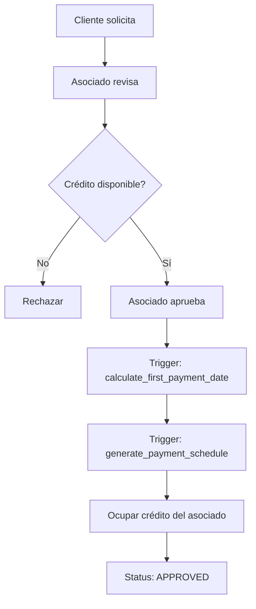
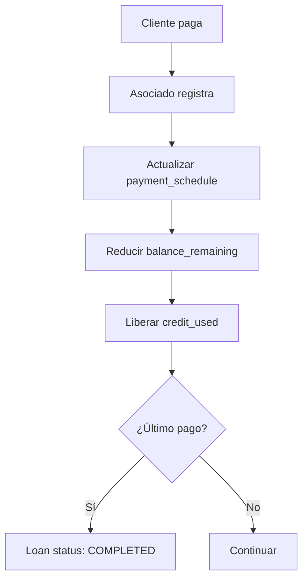
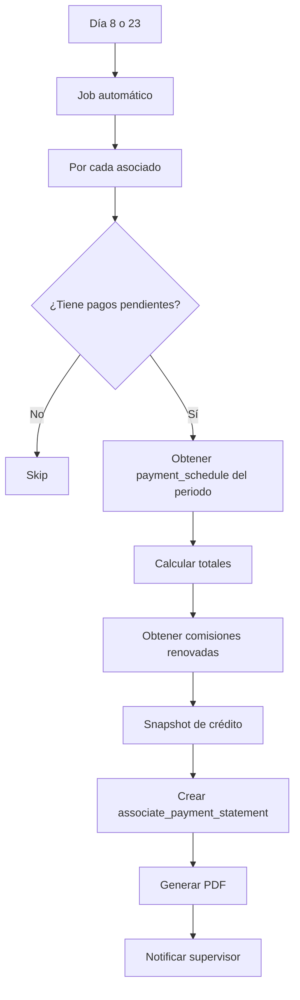

# 🎯 ÍNDICE MAESTRO - Lógica Completa del Negocio Credinet v2.0

**Fecha**: 2025-11-05  
**Versión**: 2.0 CONSOLIDADA  
**Status**: ✅ Documentación Completa

---

## 📚 MAPA COMPLETO DE DOCUMENTACIÓN

### PARTE 1: CONCEPTOS CORE DEL NEGOCIO

#### 1.1 Sistema de Doble Calendario ⭐⭐⭐
**Archivo**: [`ARQUITECTURA_DOBLE_CALENDARIO.md`](../ARQUITECTURA_DOBLE_CALENDARIO.md)

**Conceptos clave**:
- ✅ **Calendario del Cliente**: Día 15 ↔ Día 30/31 (alterno)
- ✅ **Calendario Administrativo**: Día 8-22 (Periodo A) y 23-7 (Periodo B)
- ✅ Función `calculate_first_payment_date()`: oráculo de sincronización
- ✅ Tabla `cut_periods`: 24 periodos por año
- ✅ Campo `cut_period_id` en `payment_schedule`: vincula pagos con periodos admin

**Por qué importa**: Los clientes pagan en fechas fijas (15/30), pero Credicuenta corta y reporta en fechas diferentes (8/23).

---

#### 1.2 Sistema de Doble Tasa ⭐⭐⭐
**Archivo**: [`EXPLICACION_DOS_TASAS.md`](../EXPLICACION_DOS_TASAS.md)

**Conceptos clave**:
- ✅ **Tasa del cliente** (`interest_rate`): Ej. 4.25% quincenal
- ✅ **Tasa del asociado** (`commission_rate`): Ej. 2.5% quincenal  
- ✅ **Fórmula**: `Total = Capital × (1 + tasa × plazo)` (interés simple, NO compuesto)
- ✅ **Pago quincenal** = Total / plazo
- ✅ **Comisión por pago** = pago_cliente - pago_asociado

**Ejemplo real**:
```
Capital: $22,000
Plazo: 12 quincenas
Tasa cliente: 4.25%
Tasa asociado: 2.5%

Total cliente = 22,000 × (1 + 0.0425 × 12) = $33,220
Pago quincenal cliente = 33,220 / 12 = $2,768.33

Total asociado = 22,000 × (1 + 0.025 × 12) = $28,600  
Pago quincenal asociado = 28,600 / 12 = $2,383.33

Comisión por pago = $2,768.33 - $2,383.33 = $385.00
```

---

#### 1.3 Sistema de Crédito del Asociado ⭐⭐⭐
**Archivos**: 
- [`LOGICA_DE_NEGOCIO_DEFINITIVA.md`](../LOGICA_DE_NEGOCIO_DEFINITIVA.md)
- [`frontend/LOGICA_NEGOCIO_FRONTEND.md`](../frontend/LOGICA_NEGOCIO_FRONTEND.md)

**Conceptos clave**:
- ✅ **Crédito global**: NO es por préstamo, es por asociado
- ✅ **Fórmula**: `credit_available = credit_limit - credit_used - debt_balance`
- ✅ **Ocupación**: Al APROBAR préstamo, se ocupa el monto total
- ✅ **Liberación**: Al RECIBIR PAGO del cliente, se libera proporcionalmente
- ✅ **Deuda acumulada**: Reduce el crédito disponible

**Flujo**:
```
1. Asociado tiene: credit_limit = $100,000
2. Aprueba préstamo de $20,000
   → credit_used = $20,000
   → credit_available = $80,000
3. Cliente paga $3,000
   → credit_used = $17,000
   → credit_available = $83,000
4. Asociado tiene deuda de $5,000
   → debt_balance = $5,000
   → credit_available = $78,000
```

---

#### 1.4 Relaciones de Pago (Estados de Cuenta) ⭐⭐⭐ **NUEVO**
**Archivo**: [`payment_statements/README.md`](./payment_statements/README.md)

**Conceptos clave**:
- ✅ **Documento quincenal** generado automáticamente días 8 y 23
- ✅ **Tabla completa** de préstamos activos del asociado
- ✅ **Totales calculados**: Total cobrar, Total pagar, Comisiones, Seguro
- ✅ **Snapshot de crédito**: Estado actual de la línea de crédito
- ✅ **Comisiones renovadas**: Arrastradas de préstamos anteriores
- ✅ **Firmas**: Supervisor y asociado

**Sub-documentos**:
1. [`01_CONCEPTO_Y_ESTRUCTURA.md`](./payment_statements/01_CONCEPTO_Y_ESTRUCTURA.md)
2. [`02_MODELO_BASE_DATOS.md`](./payment_statements/02_MODELO_BASE_DATOS.md)
3. [`03_LOGICA_GENERACION.md`](./payment_statements/03_LOGICA_GENERACION.md)

**Ejemplo real** (MELY):
- 51 préstamos activos
- 97 recibos (algunos clientes con múltiples préstamos)
- Total cobrar: $103,697
- Total pagar: $91,397
- Comisión: $12,680
- Seguro: $380

---

### PARTE 2: FLUJOS DE NEGOCIO

#### 2.1 Flujo de Aprobación de Préstamo

**Actores**: Cliente, Asociado, Admin



**Validaciones**:
```python
# 1. Verificar crédito asociado
if associate.credit_available < loan_amount:
    raise InsufficientCreditError()

# 2. Calcular primera fecha de pago
first_payment_date = calculate_first_payment_date(approval_date)

# 3. Generar schedule (12 pagos)
for i in range(1, 13):
    payment = PaymentSchedule(
        loan_id=loan.id,
        payment_number=i,
        due_date=calculate_payment_date(first_payment_date, i),
        expected_amount=biweekly_payment,
        associate_payment=associate_biweekly_payment,
        commission_amount=biweekly_payment - associate_biweekly_payment,
        cut_period_id=calculate_cut_period(due_date),
        status='PENDING'
    )

# 4. Ocupar crédito
associate.credit_used += loan_amount
```

---

#### 2.2 Flujo de Registro de Pago



**Cálculos**:
```python
# 1. Marcar pago como PAID
payment.status = 'PAID'
payment.amount_paid = amount
payment.payment_date = today

# 2. Reducir saldo del préstamo
principal_paid = payment.expected_amount - interest_portion
loan.balance_remaining -= principal_paid

# 3. Liberar crédito del asociado
associate.credit_used -= principal_paid

# 4. Si es último pago
if loan.balance_remaining <= 0:
    loan.status = 'COMPLETED'
    loan.completed_at = today
```

---

#### 2.3 Flujo de Generación de Relación de Pago **NUEVO**



**Pseudocódigo**:
```python
# Día 8 o 23 del mes
for associate in active_associates:
    pending = PaymentSchedule.filter(
        associate_id=associate.id,
        cut_period_id=current_period.id,
        status__in=['PENDING', 'OVERDUE']
    )
    
    if not pending:
        continue
    
    statement = AssociatePaymentStatement(
        associate_id=associate.id,
        cut_period_id=current_period.id,
        total_client_payment=sum(p.expected_amount for p in pending),
        total_associate_payment=sum(p.associate_payment for p in pending),
        commission_amount=total_client - total_associate,
        insurance_fee=len(pending) * 3.92,
        credit_snapshot=get_credit_status(associate),
        status='GENERATED'
    )
    
    generate_pdf(statement)
    notify_supervisor(statement)
```

---

### PARTE 3: MODELOS DE DATOS CRÍTICOS

#### 3.1 Tabla `loans`

**Campos clave**:
```sql
id                      SERIAL PRIMARY KEY
client_id               INT REFERENCES users(id)
associate_profile_id    INT REFERENCES associate_profiles(user_id)
amount                  DECIMAL(12,2)  -- Capital
balance_remaining       DECIMAL(12,2)  -- Saldo actual
term                    INT            -- 12 quincenas
interest_rate           DECIMAL(5,2)   -- 4.25%
commission_rate         DECIMAL(5,2)   -- 2.5%
biweekly_payment        DECIMAL(10,2)  -- Pago quincenal cliente
associate_payment       DECIMAL(10,2)  -- Pago quincenal asociado
first_payment_date      DATE           -- Calculado automáticamente
last_payment_date       DATE           -- first + (term-1)*15 días
approval_date           DATE
status                  VARCHAR(20)    -- PENDING, APPROVED, ACTIVE, COMPLETED
```

#### 3.2 Tabla `payment_schedule`

**Campos clave**:
```sql
id                      SERIAL PRIMARY KEY
loan_id                 INT REFERENCES loans(id)
payment_number          INT            -- 1 a 12
due_date                DATE           -- Fecha que debe pagar cliente
cut_period_id           INT REFERENCES cut_periods(id)  -- ⭐ Clave
expected_amount         DECIMAL(10,2)  -- Monto cliente
associate_payment       DECIMAL(10,2)  -- Monto asociado
commission_amount       DECIMAL(10,2)  -- Diferencia
balance_remaining       DECIMAL(12,2)  -- Saldo después de este pago
amount_paid             DECIMAL(10,2)  -- Lo que realmente pagó
payment_date            DATE           -- Cuándo pagó
status                  VARCHAR(20)    -- PENDING, PAID, OVERDUE, etc.
```

#### 3.3 Tabla `cut_periods`

**Campos clave**:
```sql
id                  SERIAL PRIMARY KEY
period_name         VARCHAR(20)  -- "2025-A", "2025-B"
period_number       INT          -- 1-24 (2 por mes)
start_date          DATE         -- Día 8 o 23
end_date            DATE         -- Día 22 o 7
year                INT
month               INT
period_type         VARCHAR(1)   -- 'A' o 'B'
status              VARCHAR(20)  -- ACTIVE, CLOSED
```

#### 3.4 Tabla `associate_payment_statements` **NUEVO**

**Campos clave**:
```sql
id                          SERIAL PRIMARY KEY
statement_number            VARCHAR(50)    -- ST-2025-002-005
associate_profile_id        INT REFERENCES associate_profiles(user_id)
cut_period_id               INT REFERENCES cut_periods(id)
active_payments_count       INT            -- Cantidad de recibos
total_client_payment        DECIMAL(12,2)  -- Total cobrar
total_associate_payment     DECIMAL(12,2)  -- Total pagar
commission_amount           DECIMAL(12,2)  -- Comisión del periodo
insurance_fee               DECIMAL(12,2)  -- Seguro
total_to_pay                DECIMAL(12,2)  -- Final
credit_limit                DECIMAL(12,2)  -- Snapshot
credit_used                 DECIMAL(12,2)  -- Snapshot
credit_available            DECIMAL(12,2)  -- Snapshot
debt_balance                DECIMAL(12,2)  -- Snapshot
status                      VARCHAR(20)    -- GENERATED, DELIVERED, PAID
delivered_at                TIMESTAMPTZ
pdf_path                    VARCHAR(255)
```

---

### PARTE 4: FÓRMULAS MATEMÁTICAS

#### F1: Interés Simple
```javascript
total_con_interes = capital × (1 + tasa × plazo)
```

#### F2: Pago Quincenal
```javascript
pago_quincenal = total_con_interes / plazo
```

#### F3: Comisión por Pago
```javascript
comision = pago_cliente - pago_asociado
```

#### F4: Crédito Disponible
```javascript
credit_available = credit_limit - credit_used - debt_balance
```

#### F5: Crédito Utilizado
```javascript
credit_used = SUM(balance_remaining) 
              WHERE status IN ('ACTIVE', 'APPROVED')
```

#### F6: Primera Fecha de Pago
```javascript
function calculate_first_payment_date(approval_date) {
    day = approval_date.day
    
    if (day >= 1 && day <= 14) {
        return new Date(approval_date.year, approval_date.month, 15)
    } else if (day >= 15 && day <= 30) {
        return last_day_of_month(approval_date)
    } else { // día 31
        return day_15_next_month(approval_date)
    }
}
```

#### F7: Fechas Subsecuentes
```javascript
function calculate_next_payment_date(current_date) {
    if (current_date.day == 15) {
        return last_day_of_month(current_date)
    } else {
        return day_15_next_month(current_date)
    }
}
```

#### F8: Seguro de Relación de Pago
```javascript
seguro = cantidad_recibos × $3.92
```

#### F9: Total a Pagar (Relación)
```javascript
total_a_pagar = total_associate_payment + seguro
```

---

### PARTE 5: REGLAS DE NEGOCIO

#### R1: Validación de Crédito
```python
if associate.credit_available < loan.amount:
    raise InsufficientCreditError("Asociado no tiene crédito suficiente")
```

#### R2: Ocupación de Crédito
```python
# Al aprobar:
associate.credit_used += loan.amount

# Al recibir pago:
principal_paid = payment.expected_amount - interest
associate.credit_used -= principal_paid
```

#### R3: Deuda Acumulada
```python
# Si cliente NO paga y asociado NO reporta:
associate.debt_balance += payment.expected_amount

# Impacto en crédito:
credit_available = limit - used - debt_balance
```

#### R4: Múltiples Préstamos por Cliente
```python
# Permitido: Un cliente puede tener N préstamos activos
# Restricción: Ninguna (validar en el frontend)
```

#### R5: Asociado como Cliente
```python
# Permitido: Un asociado puede tener préstamos
# Validación: associate_id != client_id (NO obligatoria)
```

#### R6: Mora del 30%
```python
# Si asociado NO entrega pago después de 2 cortes:
if days_overdue > 30 and total_to_pay > 0:
    mora = total_to_pay * 0.30
    associate.debt_balance += mora
```

#### R7: Generación Automática de Relaciones
```python
# Job ejecuta días 8 y 23 de cada mes a las 6:00 AM
# Solo genera para asociados con pagos pendientes en el periodo
```

---

### PARTE 6: CASOS ESPECIALES

#### C1: Cliente con Múltiples Préstamos
```
GUADALUPE JANETH OLIVAS CRUZ PARTE UNO   → Préstamo #1
GUADALUPE JANETH OLIVAS CRUZ PARTE DOS   → Préstamo #2
```
**Solución**: Agregar sufijo en el nombre al mostrar en relaciones de pago.

#### C2: Préstamo Renovado sin Comisión Completa
```
Cliente termina préstamo #1 con 2 comisiones pendientes
Cliente pide préstamo #2 inmediatamente
→ Las 2 comisiones se agregan a "Comisiones renovadas"
```

#### C3: Asociado con Deuda (PILAR)
```
Adeudo acumulado: $57,476
→ Reduce crédito disponible
→ $106,047 en lugar de $163,523
```

#### C4: Pago Parcial
```
Cliente debe $633 pero paga $400
→ Se registra parcial
→ Balance queda pendiente
→ Puede causar morosidad
```

#### C5: Préstamo Propio del Asociado
```
CLAUDIA tiene préstamo #25591 por $10,000
→ Aparece en SU PROPIA relación de pago
→ Debe cobrarse a sí misma
```

---

## 🎯 RECAPITULACIÓN FINAL

### Los 6 Pilares de Credinet

1. **📅 Doble Calendario**: Clientes día 15/30, Admin día 8/23
2. **💰 Doble Tasa**: Cliente e.g. 4.25%, Asociado e.g. 2.5%
3. **🏦 Crédito Global**: Línea de crédito del asociado (no por préstamo)
4. **📊 Payment Schedule**: Vincula pagos con periodos administrativos (`cut_period_id`)
5. **📄 Relaciones de Pago**: Documento quincenal automático con TODOS los cobros
6. **🔄 Ciclo de Liquidez**: Aprobar → Ocupar crédito → Cobrar → Liberar crédito

### Flujo Completo de un Préstamo

```
1. SOLICITUD
   Cliente solicita $20,000 a 12 quincenas

2. APROBACIÓN
   → Asociado aprueba el 10 de julio
   → Sistema calcula: first_payment = 15 de julio
   → Genera 12 pagos (15/jul, 31/jul, 15/ago, ...)
   → Asigna cut_period_id a cada pago
   → Ocupa $20,000 del crédito del asociado

3. CORTE QUINCENAL (Día 23)
   → Sistema genera relación de pago
   → Incluye el pago del 31/jul ($2,768)
   → Asociado recibe PDF físico

4. COBRO
   → Asociado visita cliente el 31/jul
   → Cliente paga $2,768
   → Asociado registra en sistema

5. LIBERACIÓN
   → Principal: $2,768 - intereses
   → credit_used -= principal
   → balance_remaining -= principal

6. ENTREGA A CREDICUENTA
   → Asociado entrega $91,397 (total de su relación)
   → Incluye todos los pagos cobrados
   → Menos su comisión, más seguro

7. REPETIR 11 VECES MÁS
   → Hasta completar 12 pagos
   → Loan status → COMPLETED
   → Crédito 100% liberado
```

### Confirmaciones de los PDFs

✅ **Calendario dual**: Validado con fechas 15/30 alternas  
✅ **Comisiones**: $pago_cliente - $pago_asociado confirmado  
✅ **Crédito global**: Fórmula validada con 3 asociados  
✅ **Múltiples préstamos**: PARTE UNO/DOS documentados  
✅ **Préstamos propios**: CLAUDIA y PILAR confirmados  
✅ **Deuda acumulada**: PILAR con $57,476 reduce crédito  
✅ **Seguro**: ~$3.92 por recibo confirmado  
✅ **Generación automática**: Días 8/23 confirmados  

---

## 📂 Navegación Rápida

### Para Desarrolladores Backend
1. [`ARQUITECTURA_DOBLE_CALENDARIO.md`](../ARQUITECTURA_DOBLE_CALENDARIO.md)
2. [`EXPLICACION_DOS_TASAS.md`](../EXPLICACION_DOS_TASAS.md)
3. [`payment_statements/02_MODELO_BASE_DATOS.md`](./payment_statements/02_MODELO_BASE_DATOS.md)
4. [`payment_statements/03_LOGICA_GENERACION.md`](./payment_statements/03_LOGICA_GENERACION.md)

### Para Desarrolladores Frontend
1. [`frontend/LOGICA_NEGOCIO_FRONTEND.md`](../frontend/LOGICA_NEGOCIO_FRONTEND.md)
2. [`payment_statements/01_CONCEPTO_Y_ESTRUCTURA.md`](./payment_statements/01_CONCEPTO_Y_ESTRUCTURA.md)

### Para Product Owners
1. Este documento (INDICE_MAESTRO.md)
2. [`payment_statements/README.md`](./payment_statements/README.md)
3. [`LOGICA_DE_NEGOCIO_DEFINITIVA.md`](../LOGICA_DE_NEGOCIO_DEFINITIVA.md)

---

**Última actualización**: 2025-11-05  
**Documentos analizados**: 8 documentos principales + 3 PDFs reales  
**Status**: ✅ COMPLETO Y VALIDADO
