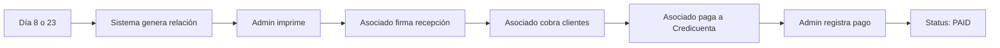

# 01 - Concepto y Estructura de Relaciones de Pago

## 🎯 Definición

**Relación de Pago** = Documento quincenal generado para cada asociado que detalla:
- Préstamos activos bajo su gestión
- Pagos a cobrar en el periodo
- Comisiones a pagar a Credicuenta
- Estado de línea de crédito
- Adeudos acumulados

**Alias**: "Estado de Cuenta Quincenal", "Corte Quincenal"

---

## 📅 Periodicidad

### Calendario de Generación

Se emiten cada **quincena**, sincronizados con los **periodos administrativos**:

- **Periodo A**: Día 8-22 del mes
- **Periodo B**: Día 23-7 del siguiente mes

**Ejemplo real** (según PDFs):
- Fecha de emisión: **30 de septiembre 2025**
- Periodo: Corte del 23/sept al 7/oct
- Entrega: Día 8 de octubre (inicio siguiente periodo)

---

## 📊 Estructura del Documento

### 1. Encabezado
```
┌─────────────────────────────────┐
│       Credi Cuenta              │
│                                 │
│  AMELIA MELENDEZ RIVERO         │ ← Nombre del asociado
└─────────────────────────────────┘
```

### 2. Tabla de Préstamos Activos

Todos los préstamos donde el asociado debe cobrar en esta quincena:

| Campo | Tipo | Ejemplo | Descripción |
|-------|------|---------|-------------|
| Contrato | INT | 25744 | ID del préstamo |
| Personal | TEXT | NORMA L. DOMINGUEZ | Cliente |
| Monto prestamo | DECIMAL | $5,000.00 | Capital original |
| Saldo actual | DECIMAL | $4,431.00 | Capital pendiente |
| Plazo | INT | 12 | Total quincenas |
| Inicio | DATE | 31-07-2025 | Primera fecha cliente |
| Fin | DATE | 15-01-2026 | Última fecha cliente |
| Pago cliente | DECIMAL | $633.00 | Monto quincenal cliente |
| No. Pago | INT | 5 | Quincena actual (1-12) |
| Pagos asociado | DECIMAL | $553.00 | Neto al asociado |

**Comisión implícita**:
```javascript
comision = pago_cliente - pagos_asociado
// $80.00 = $633.00 - $553.00
```

### 3. Comisiones Renovadas (opcional)

```
Comisiones por pagar de prestamos renovados

Cliente                              Comisión
MARIA ISABEL MESTA HERNANDEZ         $540.00
GUADALUPE JANETH OLIVAS CRUZ         $384.00
```

**Razón**: Cliente renovó préstamo sin haber pagado todas las comisiones del anterior.

### 4. Resumen Financiero

```
┌─────────────────────────────────────────┐
│ CREDITO OTORGADO:     $700,000.00       │
│ CREDITO UTILIZADO:    $552,297.00       │
│ CREDITO DISPONIBLE:   $147,703.00       │
│ ADEUDO ACUMULADO:          $0.00        │
├─────────────────────────────────────────┤
│ CANTIDAD RECIBOS:            97         │
│ TOTAL PAGO CLIENTE:   $103,697.00       │
│ TOTAL CORTE:           $91,017.00       │
│ SEGURO:                   $380.00       │
│ COMISIÓN:              $12,680.00       │
├─────────────────────────────────────────┤
│ TOTAL A PAGAR:         $91,397.00       │ ← Final
└─────────────────────────────────────────┘
```

### 5. Sección de Firmas

```
ENTREGA CORTE QUINCENAL

SUPERVISOR: IVAN ULISES MIRAMONTES BARRON
FECHA: 30-09-2025
FIRMA: _______________

ASOCIADO: AMELIA MELENDEZ RIVERO
FIRMA RECEPCION: _______________

OBSERVACIONES: ___________________________
```

---

## 📈 Análisis de PDFs Reales

### Perfil de los 3 Asociados

#### MELY (AMELIA MELENDEZ RIVERO)
- **Crédito**: $700,000 (78.9% usado)
- **Préstamos**: 51 contratos activos
- **Recibos**: 97 pagos (algunos clientes con múltiples préstamos)
- **Total cobrar**: $103,697
- **Total pagar**: $91,397
- **Comisión**: $12,680
- **Adeudo**: $0 ✅
- **Status**: Asociado grande, al corriente

#### CLAUDIA (CLAUDIA ISELA SOTELO RODRIGUEZ)
- **Crédito**: $250,000 (39.3% usado)
- **Préstamos**: 8 contratos activos
- **Recibos**: 8 pagos
- **Total cobrar**: $16,060
- **Total pagar**: $14,198
- **Comisión**: $1,920
- **Adeudo**: $0 ✅
- **Préstamo propio**: Sí (contrato 25591, $10,000)
- **Status**: Asociado pequeño, al corriente

#### PILAR (MARIA DEL PILAR BARCENAS ANDRADE)
- **Crédito**: $700,000 (84.8% usado)
- **Préstamos**: 45 contratos activos
- **Recibos**: 45 pagos
- **Total cobrar**: $111,591
- **Total pagar**: $98,549
- **Comisión**: $13,445
- **Adeudo**: **$57,476** ⚠️
- **Préstamo propio**: Sí (contrato 25562, $60,000)
- **Status**: Asociado grande, CON DEUDA

---

## 🔍 Hallazgos Importantes

### 1. Calendario Dual Confirmado

Fechas alternas en los préstamos:
```
Inicio: 31-07-2025 → Fin: 15-01-2026  (31 → 15)
Inicio: 15-07-2025 → Fin: 30-12-2025  (15 → 30)
Inicio: 30-06-2025 → Fin: 15-12-2025  (30 → 15)
```

✅ **Valida** el sistema de doble calendario documentado.

### 2. Múltiples Préstamos por Cliente

```
GUADALUPE JANETH OLIVAS CRUZ PARTE DOS
CELIA IVETTE NEVAREZ GAMEZ PARTE UNO
AMELIA MELENDEZ RIVERO PARTE UNO
```

✅ Los clientes pueden tener 2+ préstamos activos simultáneos.

### 3. Asociados como Clientes

```
CLAUDIA ISELA SOTELO RODRIGUEZ → Contrato 25591 (su propio préstamo)
MARIA DEL PILAR BARCENAS ANDRADE → Contrato 25562 (su propio préstamo)
```

✅ Los asociados pueden prestarse a sí mismos.

### 4. Fórmula de Crédito Disponible

```javascript
credit_available = credit_limit - credit_used - debt_balance

// MELY (sin deuda):
$147,703 = $700,000 - $552,297 - $0 ✅

// PILAR (con deuda):
$106,047 = $700,000 - $593,953 - $57,476 ✅
```

### 5. Cantidad de Recibos ≠ Cantidad de Préstamos

- **MELY**: 51 préstamos → 97 recibos
- **Razón**: Algunos clientes tienen 2+ préstamos (PARTE UNO, DOS)

### 6. Comisiones Renovadas

Aparecen cuando:
1. Cliente termina préstamo #1
2. Asociado NO pagó todas las comisiones
3. Cliente pide préstamo #2 (renovación)
4. Las comisiones pendientes se arrastran

---

## 💡 Propósito del Documento

### Para el Asociado:
- **Guía de trabajo**: Lista completa de clientes a visitar
- **Control de cobros**: Sabe cuánto cobrar a cada uno
- **Status financiero**: Ve su crédito disponible
- **Recordatorio**: Comisiones y seguro a pagar

### Para Credicuenta:
- **Control de cartera**: Visibilidad total por asociado
- **Tracking de comisiones**: Cálculo automático
- **Gestión de adeudos**: Identificar morosos
- **Auditoría**: Registro histórico

### Para Auditoría:
- **Comprobante legal**: Documento firmado
- **Trazabilidad**: Historial de cada periodo
- **Reconciliación**: Cruzar con pagos recibidos

---

## 🔄 Flujo de Vida del Documento



**Timeline típico**:
- **Día 8/23**: Generación automática
- **Día 8/23**: Entrega y firma
- **Días 8-22 / 23-7**: Periodo de cobro
- **Día 22 / 7**: Fecha límite de entrega
- **Después**: Mora si no pagó

---

## 📋 Casos Reales Documentados

### Caso 1: Préstamo a Mitad del Plazo
```
Contrato: 25744
Cliente: NORMA LETICIA DOMINGUEZ RIVERO
Capital: $5,000.00
Saldo: $4,431.00 (88.6% del original)
Pago actual: 5 de 12 (41.6% del plazo)
```

**Observación**: El saldo NO es proporcional al plazo. Confirma que el sistema usa **interés simple** con pago fijo quincenal.

### Caso 2: Préstamo Grande
```
Contrato: 25562
Cliente: MARIA DEL PILAR BARCENAS ANDRADE (ella misma)
Capital: $60,000.00
Saldo: $24,000.00
Pago quincenal: $6,000.00
Comisión: $6,000.00 (misma cantidad)
```

**Observación**: Tasa especial 0% (pago = capital/plazo). Posible préstamo propio sin comisión.

### Caso 3: Préstamo Terminado
```
Contrato: 25343
Cliente: ROSA ALEJANDRA DELGADO RODRIGUEZ PARTE UNO
Saldo: $0.00
Pago: 12 de 12 (último pago)
```

**Observación**: Aparece en la relación aunque está liquidado. Quizá por el último pago del periodo.

---

**Siguiente**: [02_MODELO_BASE_DATOS.md](./02_MODELO_BASE_DATOS.md)
