# 02 - Modelo de Base de Datos

## ⚠️ NOTA IMPORTANTE

**Esta documentación describe la estructura REAL implementada en la base de datos v2.0.**

Última actualización: 2025-11-06  
Verificado contra: PostgreSQL producción

---

## 🗄️ Tablas Implementadas

### 1. `associate_payment_statements` (Principal)

Registro de cada relación de pago generada para asociados.

**ESTRUCTURA ACTUAL EN BD**:

```sql
CREATE TABLE associate_payment_statements (
    id SERIAL PRIMARY KEY,
    
    -- Identificación y relaciones
    statement_number VARCHAR(50) NOT NULL,  -- ST-2025-002-005 (NO es UNIQUE actualmente)
    cut_period_id INT NOT NULL REFERENCES cut_periods(id),
    user_id INT NOT NULL REFERENCES users(id),  -- ID del asociado
    
    -- Estadísticas de pagos
    total_payments_count INT NOT NULL DEFAULT 0,  -- Cantidad total de pagos en este statement
    total_amount_collected DECIMAL(12,2) NOT NULL DEFAULT 0.00,  -- Total cobrado a clientes
    total_commission_owed DECIMAL(12,2) NOT NULL DEFAULT 0.00,  -- Comisión adeudada
    commission_rate_applied DECIMAL(5,2) NOT NULL,  -- Tasa de comisión aplicada (ej: 2.50)
    
    -- Estado del statement
    status_id INT NOT NULL REFERENCES statement_statuses(id),
    -- Valores posibles: GENERATED, SENT, PAID, OVERDUE, CANCELLED
    
    -- Fechas del ciclo de vida
    generated_date DATE NOT NULL,  -- Fecha de generación automática
    sent_date DATE,  -- Fecha de envío al asociado
    due_date DATE NOT NULL,  -- Fecha límite de pago
    paid_date DATE,  -- Fecha real de pago
    
    -- Información de pago
    paid_amount DECIMAL(12,2),  -- Monto efectivamente pagado
    payment_method_id INT REFERENCES payment_methods(id),  -- Método: efectivo, transferencia, etc.
    payment_reference VARCHAR(100),  -- Número de referencia/comprobante
    
    -- Cargos adicionales
    late_fee_amount DECIMAL(12,2) NOT NULL DEFAULT 0.00,  -- Cargo por mora
    late_fee_applied BOOLEAN NOT NULL DEFAULT false,  -- Si se aplicó cargo
    
    -- Auditoría
    created_at TIMESTAMPTZ DEFAULT CURRENT_TIMESTAMP,
    updated_at TIMESTAMPTZ DEFAULT CURRENT_TIMESTAMP,
    
    -- Constraints
    CONSTRAINT check_statements_totals_non_negative 
        CHECK(
            total_payments_count >= 0 AND 
            total_amount_collected >= 0 AND 
            total_commission_owed >= 0 AND 
            late_fee_amount >= 0
        )
);

-- Índices existentes
CREATE INDEX idx_statements_user ON associate_payment_statements(user_id);
CREATE INDEX idx_statements_cut_period ON associate_payment_statements(cut_period_id);
CREATE INDEX idx_statements_status ON associate_payment_statements(status_id);
CREATE INDEX idx_statements_number ON associate_payment_statements(statement_number);

-- Trigger para updated_at
CREATE TRIGGER update_associate_payment_statements_updated_at
    BEFORE UPDATE ON associate_payment_statements
    FOR EACH ROW
    EXECUTE FUNCTION update_updated_at_column();

COMMENT ON TABLE associate_payment_statements IS 
'Relaciones de pago generadas para asociados cada quincena (días 8 y 23)';
```

**📝 Campos Clave**:

| Campo | Tipo | Propósito |
|-------|------|-----------|
| `user_id` | INT | ID del asociado (referencia `users.id`) |
| `cut_period_id` | INT | Periodo de corte (ej: 2025-Q01) |
| `total_payments_count` | INT | Cantidad de pagos incluidos |
| `total_amount_collected` | DECIMAL | Total cobrado a clientes |
| `total_commission_owed` | DECIMAL | Comisión del asociado |
| `commission_rate_applied` | DECIMAL | Tasa aplicada (%) |
| `status_id` | INT | Estado del statement |
| `generated_date` | DATE | Fecha de generación (día 8 o 23) |
| `due_date` | DATE | Fecha límite de pago |
| `paid_date` | DATE | Fecha real de pago |
| `late_fee_amount` | DECIMAL | Cargo por mora |

---

### 2. `statement_statuses` (Catálogo)

Estados posibles de un statement.

```sql
CREATE TABLE statement_statuses (
    id SERIAL PRIMARY KEY,
    name VARCHAR(50) UNIQUE NOT NULL,
    description TEXT,
    is_active BOOLEAN DEFAULT true,
    created_at TIMESTAMPTZ DEFAULT CURRENT_TIMESTAMP
);

-- Valores iniciales
INSERT INTO statement_statuses (name, description) VALUES
('GENERATED', 'Statement generado automáticamente'),
('SENT', 'Statement enviado al asociado'),
('PAID', 'Statement pagado completamente'),
('PARTIAL_PAID', 'Statement pagado parcialmente'),
('OVERDUE', 'Statement vencido sin pagar'),
('CANCELLED', 'Statement cancelado');
```

---

## 🔮 Tablas Planificadas (Futuro)

Las siguientes tablas están **DISEÑADAS pero NO implementadas aún**:

### 3. `statement_loan_details` (Líneas de la tabla) - 🚧 FUTURO

Detalle de cada préstamo incluido en la relación.

```sql
-- ⚠️ ESTA TABLA NO EXISTE AÚN EN LA BD
CREATE TABLE statement_loan_details (
    id SERIAL PRIMARY KEY,
    
    -- Relación con statement
    statement_id INT NOT NULL REFERENCES associate_payment_statements(id) ON DELETE CASCADE,
    
    -- Relación con entidades
    loan_id INT NOT NULL REFERENCES loans(id),
    payment_id INT NOT NULL REFERENCES payments(id),
    
    -- Datos del préstamo (snapshot)
    contract_number VARCHAR(50) NOT NULL,
    client_name VARCHAR(255) NOT NULL,
    loan_amount DECIMAL(12,2) NOT NULL,
    balance_remaining DECIMAL(12,2) NOT NULL,
    total_term INT NOT NULL,
    start_date DATE NOT NULL,
    end_date DATE NOT NULL,
    
    -- Datos del pago actual
    payment_number INT NOT NULL,
    client_payment DECIMAL(10,2) NOT NULL,
    associate_payment DECIMAL(10,2) NOT NULL,
    commission DECIMAL(10,2) NOT NULL,
    due_date DATE NOT NULL,
    
    -- Orden de presentación
    display_order INT,
    
    -- Auditoría
    created_at TIMESTAMPTZ DEFAULT NOW()
);
```

**📌 Propósito**: Permitir ver el detalle completo de qué pagos específicos se incluyen en cada statement.

**🎯 Implementación futura**: Sprint 7 o posterior.

---

### 4. `renewed_commission_details` (Comisiones arrastradas) - 🚧 FUTURO

```sql
-- ⚠️ ESTA TABLA NO EXISTE AÚN EN LA BD
CREATE TABLE renewed_commission_details (
    id SERIAL PRIMARY KEY,
    
    -- Relación con statement
    statement_id INT NOT NULL REFERENCES associate_payment_statements(id) ON DELETE CASCADE,
    
    -- Origen
    original_loan_id INT REFERENCES loans(id),
    client_id INT NOT NULL REFERENCES users(id),
    client_name VARCHAR(255) NOT NULL,
    
    -- Monto
    commission_amount DECIMAL(10,2) NOT NULL,
    
    -- Descripción
    reason TEXT NOT NULL,
    
    created_at TIMESTAMPTZ DEFAULT NOW()
);
```

**📌 Propósito**: Rastrear comisiones pendientes de préstamos renovados que se cobran en el statement actual.

**🎯 Implementación futura**: Cuando se implemente sistema de renovaciones.

---

## 🔗 Relaciones Entre Tablas (Implementadas)

```
users (asociados)
       ↓
associate_payment_statements ← cut_periods
       ↓                            ↓
       ↓                       statement_statuses
       ↓
 payment_methods (opcional)
```

**Relaciones futuras** (cuando se implementen tablas auxiliares):

```
users (asociados)
       ↓
associate_payment_statements ← cut_periods
       ↓
  ┌────┴────┬──────────────┐
  ↓         ↓              ↓
statement_loan_details  renewed_commission_details  (pagos múltiples del asociado)
  ↓         ↓
loans    payments
```

---

## 📊 Queries Útiles

### 1. Listar statements de un asociado

```sql
SELECT 
    aps.id,
    aps.statement_number,
    cp.cut_code AS periodo,
    cp.period_start_date,
    cp.period_end_date,
    aps.total_payments_count,
    aps.total_amount_collected,
    aps.total_commission_owed,
    ss.name AS status,
    aps.generated_date,
    aps.due_date,
    aps.paid_date
FROM associate_payment_statements aps
JOIN cut_periods cp ON cp.id = aps.cut_period_id
JOIN statement_statuses ss ON ss.id = aps.status_id
WHERE aps.user_id = :associate_id
ORDER BY aps.generated_date DESC;
```

### 2. Statements pendientes de pago

```sql
SELECT 
    u.username AS asociado,
    u.first_name || ' ' || u.last_name AS nombre_completo,
    aps.statement_number,
    cp.cut_code,
    aps.total_commission_owed,
    aps.due_date,
    CASE 
        WHEN aps.due_date < CURRENT_DATE THEN 'VENCIDO'
        WHEN aps.due_date = CURRENT_DATE THEN 'VENCE HOY'
        ELSE 'PENDIENTE'
    END AS urgencia,
    (CURRENT_DATE - aps.due_date) AS dias_vencido
FROM associate_payment_statements aps
JOIN users u ON u.id = aps.user_id
JOIN cut_periods cp ON cp.id = aps.cut_period_id
WHERE aps.status_id = (SELECT id FROM statement_statuses WHERE name = 'GENERATED')
  AND aps.due_date <= CURRENT_DATE + INTERVAL '7 days'
ORDER BY aps.due_date ASC;
```

### 3. Resumen financiero de un periodo

```sql
SELECT 
    cp.cut_code,
    COUNT(aps.id) AS total_statements,
    COUNT(DISTINCT aps.user_id) AS asociados_activos,
    SUM(aps.total_payments_count) AS total_pagos,
    SUM(aps.total_amount_collected) AS total_cobrado_clientes,
    SUM(aps.total_commission_owed) AS total_comisiones,
    SUM(aps.late_fee_amount) AS total_cargos_mora,
    COUNT(CASE WHEN ss.name = 'PAID' THEN 1 END) AS statements_pagados,
    COUNT(CASE WHEN ss.name = 'OVERDUE' THEN 1 END) AS statements_vencidos
FROM associate_payment_statements aps
JOIN cut_periods cp ON cp.id = aps.cut_period_id
JOIN statement_statuses ss ON ss.id = aps.status_id
WHERE cp.id = :periodo_id
GROUP BY cp.cut_code;
```

### 4. Historial de pagos de un statement

```sql
SELECT 
    aps.statement_number,
    aps.total_commission_owed AS monto_total,
    aps.paid_amount AS monto_pagado,
    aps.paid_date AS fecha_pago,
    pm.name AS metodo_pago,
    aps.payment_reference AS referencia,
    aps.late_fee_amount AS cargo_mora,
    aps.late_fee_applied AS se_cobro_mora
FROM associate_payment_statements aps
LEFT JOIN payment_methods pm ON pm.id = aps.payment_method_id
WHERE aps.id = :statement_id;
```

---

## 📊 Modelo SQLAlchemy (Python)

### AssociatePaymentStatement

```python
from sqlalchemy import Column, Integer, String, DECIMAL, Date, TIMESTAMPTZ, ForeignKey, Boolean
from sqlalchemy.orm import relationship
from app.core.database import Base

class AssociatePaymentStatement(Base):
    __tablename__ = "associate_payment_statements"
    
    id = Column(Integer, primary_key=True, index=True)
    statement_number = Column(String(50), nullable=False, index=True)
    
    # Relaciones
    user_id = Column(Integer, ForeignKey("users.id"), nullable=False, index=True)
    cut_period_id = Column(Integer, ForeignKey("cut_periods.id"), nullable=False, index=True)
    
    # Estadísticas
    total_payments_count = Column(Integer, nullable=False, default=0)
    total_amount_collected = Column(DECIMAL(12, 2), nullable=False, default=0.00)
    total_commission_owed = Column(DECIMAL(12, 2), nullable=False, default=0.00)
    commission_rate_applied = Column(DECIMAL(5, 2), nullable=False)
    
    # Estado
    status_id = Column(Integer, ForeignKey("statement_statuses.id"), nullable=False, index=True)
    
    # Fechas
    generated_date = Column(Date, nullable=False)
    sent_date = Column(Date, nullable=True)
    due_date = Column(Date, nullable=False)
    paid_date = Column(Date, nullable=True)
    
    # Información de pago
    paid_amount = Column(DECIMAL(12, 2), nullable=True)
    payment_method_id = Column(Integer, ForeignKey("payment_methods.id"), nullable=True)
    payment_reference = Column(String(100), nullable=True)
    
    # Cargos
    late_fee_amount = Column(DECIMAL(12, 2), nullable=False, default=0.00)
    late_fee_applied = Column(Boolean, nullable=False, default=False)
    
    # Auditoría
    created_at = Column(TIMESTAMPTZ, server_default="CURRENT_TIMESTAMP")
    updated_at = Column(TIMESTAMPTZ, server_default="CURRENT_TIMESTAMP", onupdate="CURRENT_TIMESTAMP")
    
    # Relationships
    associate = relationship("User", foreign_keys=[user_id])
    cut_period = relationship("CutPeriod", foreign_keys=[cut_period_id])
    status = relationship("StatementStatus", foreign_keys=[status_id])
    payment_method = relationship("PaymentMethod", foreign_keys=[payment_method_id])
```

---

## 🎯 DTOs Recomendados (Pydantic)

### Request DTO

```python
from pydantic import BaseModel, Field
from decimal import Decimal
from datetime import date
from typing import Optional

class CreateStatementDTO(BaseModel):
    """DTO para crear un nuevo statement (generalmente automático)"""
    user_id: int = Field(..., description="ID del asociado")
    cut_period_id: int = Field(..., description="ID del periodo de corte")
    total_payments_count: int = Field(0, ge=0)
    total_amount_collected: Decimal = Field(Decimal("0.00"), ge=0)
    total_commission_owed: Decimal = Field(Decimal("0.00"), ge=0)
    commission_rate_applied: Decimal = Field(..., ge=0, le=100)
    generated_date: date
    due_date: date
    
class MarkStatementPaidDTO(BaseModel):
    """DTO para marcar un statement como pagado"""
    paid_amount: Decimal = Field(..., gt=0)
    paid_date: date
    payment_method_id: int
    payment_reference: Optional[str] = None
    
class ApplyLateFeeDTO(BaseModel):
    """DTO para aplicar cargo por mora"""
    late_fee_amount: Decimal = Field(..., gt=0)
    reason: Optional[str] = None
```

### Response DTO

```python
from pydantic import BaseModel
from decimal import Decimal
from datetime import date, datetime
from typing import Optional

class StatementResponseDTO(BaseModel):
    """DTO de respuesta completo"""
    id: int
    statement_number: str
    user_id: int
    associate_name: str  # Computed
    cut_period_id: int
    cut_period_code: str  # Computed (ej: 2025-Q01)
    
    # Estadísticas
    total_payments_count: int
    total_amount_collected: Decimal
    total_commission_owed: Decimal
    commission_rate_applied: Decimal
    
    # Estado
    status_id: int
    status_name: str  # Computed
    
    # Fechas
    generated_date: date
    sent_date: Optional[date]
    due_date: date
    paid_date: Optional[date]
    
    # Pago
    paid_amount: Optional[Decimal]
    payment_method_id: Optional[int]
    payment_method_name: Optional[str]  # Computed
    payment_reference: Optional[str]
    
    # Cargos
    late_fee_amount: Decimal
    late_fee_applied: bool
    
    # Computed
    is_overdue: bool
    days_overdue: Optional[int]
    remaining_amount: Optional[Decimal]
    
    # Auditoría
    created_at: datetime
    updated_at: datetime
    
    class Config:
        from_attributes = True

class StatementSummaryDTO(BaseModel):
    """DTO resumido para listados"""
    id: int
    statement_number: str
    associate_name: str
    cut_period_code: str
    total_commission_owed: Decimal
    status_name: str
    due_date: date
    is_overdue: bool
    
    class Config:
        from_attributes = True
```

---

## 🚀 Endpoints Sugeridos

### 1. Listar statements

```
GET /api/v1/statements
Query params:
  - user_id (opcional): Filtrar por asociado
  - cut_period_id (opcional): Filtrar por periodo
  - status (opcional): Filtrar por estado
  - is_overdue (opcional): Solo vencidos
  - page, limit: Paginación

Response: StatementSummaryDTO[]
```

### 2. Obtener statement detallado

```
GET /api/v1/statements/:id
Response: StatementResponseDTO
```

### 3. Generar statement (automático)

```
POST /api/v1/statements/generate
Body: CreateStatementDTO
Response: StatementResponseDTO
```

### 4. Marcar como pagado

```
POST /api/v1/statements/:id/mark-paid
Body: MarkStatementPaidDTO
Response: StatementResponseDTO
```

### 5. Aplicar cargo por mora

```
POST /api/v1/statements/:id/apply-late-fee
Body: ApplyLateFeeDTO
Response: StatementResponseDTO
```

### 6. Estadísticas de periodo

```
GET /api/v1/statements/stats/period/:cut_period_id
Response: {
  total_statements: number,
  total_associates: number,
  total_collected: Decimal,
  total_commissions: Decimal,
  paid_count: number,
  overdue_count: number
}
```

---

## ✅ Validaciones de Negocio

### Al crear statement:

1. ✅ Validar que `user_id` sea un asociado válido
2. ✅ Validar que `cut_period_id` exista
3. ✅ Validar que NO exista statement duplicado (mismo asociado + periodo)
4. ✅ `due_date` debe ser posterior a `generated_date`
5. ✅ `commission_rate_applied` debe estar entre 0 y 100
6. ✅ Todos los montos deben ser >= 0

### Al marcar como pagado:

1. ✅ Statement debe existir y NO estar ya pagado
2. ✅ `paid_amount` debe ser > 0
3. ✅ `paid_date` debe ser >= `generated_date`
4. ✅ `payment_method_id` debe existir
5. ✅ Actualizar `status_id` a PAID o PARTIAL_PAID según corresponda

### Al aplicar cargo por mora:

1. ✅ Statement debe estar vencido (`due_date` < hoy)
2. ✅ Statement NO debe estar pagado
3. ✅ NO aplicar cargo si `late_fee_applied = true`
4. ✅ Registrar fecha de aplicación

---

## 🔄 Flujo de Estados

```mermaid
stateDiagram-v2
    [*] --> GENERATED: Sistema genera automáticamente
    GENERATED --> SENT: Se envía al asociado
    SENT --> PAID: Asociado paga completo
    SENT --> PARTIAL_PAID: Asociado paga parcial
    PARTIAL_PAID --> PAID: Completa el pago
    SENT --> OVERDUE: Vence sin pagar
    OVERDUE --> PAID: Paga después de vencido
    GENERATED --> CANCELLED: Cancelado por admin
    PAID --> [*]
    CANCELLED --> [*]
```



---

## � Generación Automática

Los statements se generan **automáticamente** los días **8 y 23** de cada mes mediante un job programado:

```python
# Pseudocódigo del job
def generate_statements_for_period(cut_period_id: int):
    """
    Genera statements para todos los asociados con pagos pendientes en el periodo
    """
    # 1. Obtener periodo de corte
    cut_period = get_cut_period(cut_period_id)
    
    # 2. Por cada asociado activo
    for associate in get_active_associates():
        # 3. Buscar pagos pendientes del periodo
        pending_payments = get_pending_payments(
            associate_id=associate.id,
            cut_period_id=cut_period.id
        )
        
        if not pending_payments:
            continue  # Skip si no tiene pagos
        
        # 4. Calcular totales
        total_collected = sum(p.expected_amount for p in pending_payments)
        total_commission = sum(p.commission_amount for p in pending_payments)
        
        # 5. Crear statement
        statement = create_statement(
            user_id=associate.id,
            cut_period_id=cut_period.id,
            total_payments_count=len(pending_payments),
            total_amount_collected=total_collected,
            total_commission_owed=total_commission,
            commission_rate_applied=associate.commission_rate,
            generated_date=today(),
            due_date=cut_period.period_end_date + timedelta(days=7)
        )
        
        # 6. Notificar
        notify_supervisor(statement)
        send_email_to_associate(statement)
```

---

## 🎯 Resumen de Cambios vs Documentación Original

| Aspecto | Documentación Original | Implementación Real |
|---------|------------------------|---------------------|
| Campo principal | `associate_profile_id` | `user_id` |
| Estadísticas | `total_loans_count`, `active_payments_count` | Solo `total_payments_count` |
| Montos | 6 campos detallados | 3 campos básicos |
| Crédito snapshot | 4 campos (limit, used, available, debt) | ❌ NO implementado |
| Estado | VARCHAR (string) | INT (foreign key) |
| Entrega | 3 campos (delivered_at, by, received_by) | ❌ NO implementado |
| Documento | `pdf_path` | ❌ NO implementado |
| Fechas | 2 campos | 4 campos (generated, sent, due, paid) |
| Pago | 1 campo básico | 4 campos detallados |
| Mora | ❌ NO documentado | 2 campos (amount, applied) |

**Conclusión**: La implementación actual es más **simple y enfocada** que el diseño original. Las funcionalidades avanzadas (snapshot de crédito, entrega, PDF) están planificadas para futuro.
    
    # Montos
    total_client_payment = Column(DECIMAL(12, 2), default=0)
    total_associate_payment = Column(DECIMAL(12, 2), default=0)
    commission_amount = Column(DECIMAL(12, 2), default=0)
    renewed_commissions = Column(DECIMAL(12, 2), default=0)
    insurance_fee = Column(DECIMAL(12, 2), default=0)
    total_to_pay = Column(DECIMAL(12, 2), default=0)
    
    # Snapshot crédito
    credit_limit = Column(DECIMAL(12, 2), nullable=False)
    credit_used = Column(DECIMAL(12, 2), nullable=False)
    credit_available = Column(DECIMAL(12, 2), nullable=False)
    debt_balance = Column(DECIMAL(12, 2), default=0)
    
    # Estado
    status = Column(String(20), default="GENERATED")
    
    # Entrega
    delivered_at = Column(TIMESTAMPTZ)
    delivered_by = Column(Integer, ForeignKey("users.id"))
    received_by = Column(Integer, ForeignKey("users.id"))
    
    # Documento
    pdf_path = Column(String(255))
    notes = Column(Text)
    
    # Auditoría
    created_at = Column(TIMESTAMPTZ, server_default="NOW()")
    updated_at = Column(TIMESTAMPTZ, server_default="NOW()", onupdate="NOW()")
    
    # Relationships
    associate = relationship("AssociateProfile", back_populates="payment_statements")
    cut_period = relationship("CutPeriod", back_populates="payment_statements")
    loan_details = relationship("StatementLoanDetail", back_populates="statement", cascade="all, delete-orphan")
    renewed_commissions = relationship("RenewedCommissionDetail", back_populates="statement", cascade="all, delete-orphan")
    payments = relationship("StatementPayment", back_populates="statement")
    
    delivered_by_user = relationship("User", foreign_keys=[delivered_by])
    received_by_user = relationship("User", foreign_keys=[received_by])
```

### StatementLoanDetail

```python
class StatementLoanDetail(Base):
    __tablename__ = "statement_loan_details"
    
    id = Column(Integer, primary_key=True, index=True)
    statement_id = Column(Integer, ForeignKey("associate_payment_statements.id", ondelete="CASCADE"), nullable=False)
    loan_id = Column(Integer, ForeignKey("loans.id"), nullable=False)
    payment_schedule_id = Column(Integer, ForeignKey("payment_schedule.id"), nullable=False)
    
    # Snapshot data
    contract_number = Column(String(50), nullable=False)
    client_name = Column(String(255), nullable=False)
    loan_amount = Column(DECIMAL(12, 2), nullable=False)
    balance_remaining = Column(DECIMAL(12, 2), nullable=False)
    total_term = Column(Integer, nullable=False)
    start_date = Column(Date, nullable=False)
    end_date = Column(Date, nullable=False)
    
    payment_number = Column(Integer, nullable=False)
    client_payment = Column(DECIMAL(10, 2), nullable=False)
    associate_payment = Column(DECIMAL(10, 2), nullable=False)
    commission = Column(DECIMAL(10, 2), nullable=False)
    due_date = Column(Date, nullable=False)
    
    display_order = Column(Integer)
    created_at = Column(TIMESTAMPTZ, server_default="NOW()")
    
    # Relationships
    statement = relationship("AssociatePaymentStatement", back_populates="loan_details")
    loan = relationship("Loan")
    payment_schedule = relationship("PaymentSchedule")
```

---

## 🔍 Queries Comunes

### Obtener relación completa

```sql
SELECT 
    s.*,
    ap.full_name as associate_name,
    cp.period_name,
    cp.start_date as period_start,
    cp.end_date as period_end,
    COUNT(sld.id) as detail_count
FROM associate_payment_statements s
JOIN associate_profiles ap ON s.associate_profile_id = ap.user_id
JOIN cut_periods cp ON s.cut_period_id = cp.id
LEFT JOIN statement_loan_details sld ON s.id = sld.statement_id
WHERE s.id = $1
GROUP BY s.id, ap.full_name, cp.period_name, cp.start_date, cp.end_date;
```

### Relaciones pendientes de pago

```sql
SELECT s.*, ap.full_name
FROM associate_payment_statements s
JOIN associate_profiles ap ON s.associate_profile_id = ap.user_id
WHERE s.status IN ('DELIVERED', 'PARTIAL_PAID')
  AND (s.delivered_at + INTERVAL '15 days') < NOW()
ORDER BY s.delivered_at;
```

### Historial de pagos de una relación

```sql
SELECT sp.*, u.full_name as registered_by_name
FROM statement_payments sp
JOIN users u ON sp.registered_by = u.id
WHERE sp.statement_id = $1
ORDER BY sp.payment_date DESC;
```

---

**Siguiente**: [03_LOGICA_GENERACION.md](./03_LOGICA_GENERACION.md)
