# 🎨 Flujos de Usuario - Credinet Frontend MVP

**Versión**: 1.0  
**Fecha**: 2025-11-05  
**Propósito**: Diagramas de flujo para guiar implementación del frontend

---

## 👥 Personas (Usuarios del Sistema)

### 1. **Admin** (Administrador Credinet)
- Aprueba/rechaza préstamos
- Registra pagos manualmente
- Cierra períodos de corte
- Ve reportes generales

### 2. **Asociado** (Socio Inversionista)
- Ve sus préstamos activos
- Consulta comisiones ganadas
- Reporta clientes morosos
- Ve su crédito disponible

### 3. **Cliente** (Usuario Final)
- Solicita préstamo (futuro - no MVP)
- Ve sus pagos pendientes
- Ve calendario de pagos
- Consulta saldo

---

## 🔄 FLUJO 1: Solicitar Préstamo (Cliente → Admin)

```mermaid
flowchart TD
    Start([Cliente accede al sistema]) --> Login[Login como CLIENTE]
    Login --> Dashboard[Dashboard Cliente]
    Dashboard --> BtnSolicitar[Click 'Solicitar Préstamo']
    
    BtnSolicitar --> Form[Formulario de Solicitud]
    Form --> FormFields{Completar campos}
    
    FormFields -->|Monto| InputMonto[Monto: $1,000 - $100,000]
    FormFields -->|Plazo| InputPlazo[Plazo: 6-24 quincenas]
    FormFields -->|Motivo| InputMotivo[Motivo del préstamo]
    
    InputMonto --> Validate{Validar datos}
    InputPlazo --> Validate
    InputMotivo --> Validate
    
    Validate -->|Error| FormFields
    Validate -->|OK| Preview[Vista previa de cálculos]
    
    Preview --> ShowCalc[Mostrar:<br/>- Pago quincenal<br/>- Total a pagar<br/>- Total interés<br/>- Comisión]
    ShowCalc --> Confirm{Confirmar?}
    
    Confirm -->|No| Dashboard
    Confirm -->|Sí| Submit[Enviar solicitud]
    
    Submit --> API[POST /api/loans<br/>status: PENDING]
    API --> Success[✅ Solicitud enviada]
    Success --> Notif[Notificación al Admin]
    
    Notif --> End([Fin - Esperar aprobación])
    
    style Start fill:#e1f5e1
    style End fill:#e1f5e1
    style Preview fill:#fff3cd
    style ShowCalc fill:#fff3cd
    style API fill:#cfe2ff
    style Success fill:#d1e7dd
```



**Componentes UI necesarios**:
- `LoanRequestForm.jsx` - Formulario principal
- `LoanCalculatorPreview.jsx` - Vista previa de cálculos
- `MoneyInput.jsx` - Input con formato de moneda
- `TermSelector.jsx` - Selector de plazo (slider 6-24)

**Mock API**:
```javascript
POST /api/loans
Body: { 
  amount: 25000, 
  term_biweeks: 12, 
  loan_reason: "Negocio",
  client_id: 1
}
Response: { 
  id: 6, 
  status: "PENDING",
  biweekly_payment: 3145.83,
  total_payment: 37750.00
}
```

---

## ✅ FLUJO 2: Aprobar Préstamo (Admin)

```mermaid
flowchart TD
    Start([Admin accede al sistema]) --> Login[Login como ADMIN]
    Login --> Dashboard[Dashboard Admin]
    Dashboard --> ListLoans[Lista de Préstamos Pendientes]
    
    ListLoans --> Select[Seleccionar préstamo]
    Select --> Details[Ver detalles completos]
    
    Details --> ShowInfo[Mostrar:<br/>- Cliente<br/>- Monto<br/>- Plazo<br/>- Cálculos<br/>- Motivo]
    
    ShowInfo --> Decision{Decisión}
    
    Decision -->|Rechazar| RejectReason[Ingresar motivo rechazo]
    RejectReason --> RejectAPI[PUT /api/loans/:id/reject]
    RejectAPI --> RejectSuccess[❌ Préstamo rechazado]
    RejectSuccess --> NotifReject[Notificar cliente]
    NotifReject --> End1([Fin])
    
    Decision -->|Aprobar| ApproveConfirm{Confirmar aprobación?}
    ApproveConfirm -->|No| Details
    ApproveConfirm -->|Sí| SelectAssociate[Seleccionar asociado]
    
    SelectAssociate --> CheckCredit{Verificar crédito<br/>disponible}
    CheckCredit -->|Insuficiente| ErrorCredit[⚠️ Crédito insuficiente]
    ErrorCredit --> SelectAssociate
    
    CheckCredit -->|OK| ApproveAPI[PUT /api/loans/:id/approve<br/>associate_id, approved_by]
    
    ApproveAPI --> TriggerBD[⚙️ TRIGGER en BD:<br/>generate_payment_schedule]
    TriggerBD --> GeneratePayments[Genera 12 payments<br/>con calendario dual]
    
    GeneratePayments --> ApproveSuccess[✅ Préstamo aprobado]
    ApproveSuccess --> ShowSchedule[Mostrar calendario<br/>de 12 pagos]
    
    ShowSchedule --> NotifClient[Notificar cliente]
    NotifClient --> NotifAssociate[Notificar asociado]
    NotifAssociate --> End2([Fin])
    
    style Start fill:#e1f5e1
    style End1 fill:#e1f5e1
    style End2 fill:#e1f5e1
    style TriggerBD fill:#d1e7dd
    style GeneratePayments fill:#d1e7dd
    style ApproveSuccess fill:#d1e7dd
    style RejectSuccess fill:#f8d7da
    style ErrorCredit fill:#fff3cd
```



**Componentes UI necesarios**:
- `LoanApprovalCard.jsx` - Card de préstamo pendiente
- `LoanDetailsModal.jsx` - Modal con detalles completos
- `AssociateSelector.jsx` - Dropdown de asociados con crédito disponible
- `ApprovalConfirmDialog.jsx` - Dialog de confirmación
- `PaymentSchedulePreview.jsx` - Vista previa del calendario

**Mock API**:
```javascript
GET /api/loans?status=PENDING
Response: [
  { id: 6, client_name: "Juan Pérez", amount: 25000, status: "PENDING" }
]

PUT /api/loans/6/approve
Body: { associate_id: 2, approved_by: 1 }
Response: { 
  success: true, 
  payments_generated: 12,
  first_payment_date: "2025-11-15"
}
```

---

## 💰 FLUJO 3: Registrar Pago (Admin/Cliente)

```mermaid
flowchart TD
    Start([Usuario accede]) --> Login{Tipo usuario}
    
    Login -->|Admin| DashboardAdmin[Dashboard Admin]
    Login -->|Cliente| DashboardClient[Dashboard Cliente]
    
    DashboardAdmin --> SelectLoan[Seleccionar préstamo activo]
    DashboardClient --> MyLoan[Ver mi préstamo]
    
    SelectLoan --> ListPayments[Lista de pagos pendientes]
    MyLoan --> ListPayments
    
    ListPayments --> SelectPayment[Seleccionar pago]
    SelectPayment --> Details[Ver detalles del pago]
    
    Details --> ShowPaymentInfo[Mostrar:<br/>- #Pago<br/>- Monto esperado<br/>- Fecha vencimiento<br/>- Desglose<br/>- Estado]
    
    ShowPaymentInfo --> ActionChoice{Acción}
    
    ActionChoice -->|Ver desglose| ShowBreakdown[Mostrar tabla:<br/>- Interés<br/>- Capital<br/>- Comisión<br/>- Balance restante]
    ShowBreakdown --> ActionChoice
    
    ActionChoice -->|Registrar pago| PaymentForm[Formulario de pago]
    
    PaymentForm --> FormFields{Completar}
    FormFields --> InputAmount[Monto pagado]
    FormFields --> InputDate[Fecha de pago]
    FormFields --> InputMethod[Método: Efectivo/Trans/Dep]
    FormFields --> InputProof[Comprobante opcional]
    
    InputAmount --> Validate{Validar}
    InputDate --> Validate
    InputMethod --> Validate
    
    Validate -->|Monto inválido| Warning[⚠️ Monto diferente<br/>a lo esperado]
    Warning --> ConfirmPartial{Pago parcial?}
    ConfirmPartial -->|No| FormFields
    ConfirmPartial -->|Sí| SubmitPartial
    
    Validate -->|OK| Submit[Confirmar registro]
    Submit --> SubmitPartial[POST /api/payments/:id]
    
    SubmitPartial --> UpdateBD[Actualizar BD:<br/>- amount_paid<br/>- payment_date<br/>- status: PAID]
    
    UpdateBD --> TriggerCredit[⚙️ TRIGGER:<br/>Actualizar crédito asociado]
    TriggerCredit --> Success[✅ Pago registrado]
    
    Success --> CheckComplete{Todos pagos<br/>completos?}
    CheckComplete -->|No| UpdateList[Actualizar lista]
    CheckComplete -->|Sí| LoanComplete[✅ Préstamo COMPLETADO]
    
    UpdateList --> End1([Fin])
    LoanComplete --> NotifAll[Notificar todos]
    NotifAll --> End2([Fin])
    
    style Start fill:#e1f5e1
    style End1 fill:#e1f5e1
    style End2 fill:#e1f5e1
    style Success fill:#d1e7dd
    style LoanComplete fill:#d1e7dd
    style Warning fill:#fff3cd
```



**Componentes UI necesarios**:
- `PaymentCard.jsx` - Card de pago pendiente
- `PaymentDetailsModal.jsx` - Modal con desglose completo
- `PaymentForm.jsx` - Formulario de registro
- `PaymentBreakdownTable.jsx` - Tabla de desglose financiero
- `FileUpload.jsx` - Upload de comprobante

**Mock API**:
```javascript
GET /api/loans/6/payments
Response: [
  {
    id: 45,
    payment_number: 1,
    expected_amount: 3145.83,
    payment_due_date: "2025-11-15",
    interest_amount: 1062.50,
    principal_amount: 2083.33,
    balance_remaining: 22916.67,
    status: "PENDING"
  }
]

POST /api/payments/45
Body: { 
  amount_paid: 3145.83, 
  payment_date: "2025-11-15",
  payment_method: "TRANSFER"
}
Response: { 
  success: true, 
  payment_id: 45,
  new_status: "PAID"
}
```

---

## 📅 FLUJO 4: Ver Calendario de Pagos (Cliente)


**Componentes UI necesarios**:
- `PaymentCalendar.jsx` - Calendario mensual con fechas marcadas
- `PaymentList.jsx` - Lista de cards de pagos
- `PaymentTimeline.jsx` - Timeline con progreso
- `PaymentCard.jsx` - Card individual (reutilizable)
- `PaymentDetailModal.jsx` - Modal de detalle (reutilizable)
- `FilterBar.jsx` - Barra de filtros
- `ProgressIndicator.jsx` - Indicador de progreso

**Mock Data**:
```json
{
  "loan": {
    "id": 6,
    "amount": 25000,
    "term_biweeks": 12,
    "total_payment": 37750,
    "biweekly_payment": 3145.83
  },
  "payments": [
    {
      "id": 45,
      "payment_number": 1,
      "payment_due_date": "2025-11-15",
      "expected_amount": 3145.83,
      "status": "PAID",
      "amount_paid": 3145.83,
      "payment_date": "2025-11-14"
    },
    {
      "id": 46,
      "payment_number": 2,
      "payment_due_date": "2025-11-30",
      "expected_amount": 3145.83,
      "status": "PENDING"
    }
    // ... resto de pagos
  ],
  "progress": {
    "payments_made": 1,
    "payments_total": 12,
    "percent_complete": 8.33,
    "balance_remaining": 34604.17
  }
}
```

---

## 📊 FLUJO 5: Dashboard Asociado

```mermaid
flowchart TD
    Start([Asociado accede]) --> Login[Login como ASOCIADO]
    Login --> Dashboard[Dashboard Asociado]
    
    Dashboard --> Sections[Ver secciones]
    
    Sections --> Credit[Crédito Disponible]
    Credit --> ShowCredit[Mostrar:<br/>- Límite total<br/>- Usado<br/>- Disponible<br/>- Deuda pendiente]
    
    Sections --> ActiveLoans[Préstamos Activos]
    ActiveLoans --> ListLoans[Lista de préstamos]
    ListLoans --> LoanDetails[Ver detalles de c/u]
    LoanDetails --> LoanMetrics[Métricas:<br/>- Cliente<br/>- Monto<br/>- Pagos X/Y<br/>- Comisión ganada]
    
    Sections --> Earnings[Comisiones]
    Earnings --> EarningsChart[Gráfico de comisiones:<br/>- Por período<br/>- Por préstamo<br/>- Total acumulado]
    
    Sections --> Statements[Estados de Cuenta]
    Statements --> ListPeriods[Lista de períodos]
    ListPeriods --> PeriodDetail[Ver estado de cuenta]
    PeriodDetail --> StatementInfo[Mostrar:<br/>- Pagos reportados<br/>- Comisión período<br/>- Deuda generada<br/>- Saldo acumulado]
    
    ShowCredit --> Actions{Acciones}
    LoanMetrics --> Actions
    EarningsChart --> Actions
    StatementInfo --> Actions
    
    Actions -->|Reportar moroso| ReportModal[Modal reportar cliente]
    ReportModal --> ReportForm[Formulario reporte]
    ReportForm --> SubmitReport[POST /api/defaulted-clients]
    SubmitReport --> ReportSuccess[✅ Reporte enviado]
    ReportSuccess --> End1([Fin])
    
    Actions -->|Descargar reporte| DownloadPDF[Generar PDF]
    DownloadPDF --> End2([Fin])
    
    Actions -->|Ver histórico| HistoryView[Vista histórico]
    HistoryView --> End3([Fin])
    
    style Start fill:#e1f5e1
    style End1 fill:#e1f5e1
    style End2 fill:#e1f5e1
    style End3 fill:#e1f5e1
    style Dashboard fill:#cfe2ff
```



**Componentes UI necesarios**:
- `AssociateDashboard.jsx` - Dashboard principal
- `CreditSummaryCard.jsx` - Card de crédito disponible
- `ActiveLoansTable.jsx` - Tabla de préstamos activos
- `EarningsChart.jsx` - Gráfico de comisiones (Chart.js)
- `PeriodStatementCard.jsx` - Card de estado de cuenta
- `ReportDefaultedModal.jsx` - Modal para reportar moroso

---

## 🎯 Prioridades de Implementación (MVP)

### Sprint Frontend 1 (Semana 1)
1. ✅ **Setup proyecto** + routing + auth mock
2. ✅ **Dashboard Admin**: Lista préstamos + aprobar/rechazar
3. ✅ **Vista detalle préstamo**: Con cálculos y desglose
4. ✅ **Mock API completa**: Todos los endpoints simulados

### Sprint Frontend 2 (Semana 2)
5. ✅ **Calendario de pagos**: 3 vistas (lista, calendario, timeline)
6. ✅ **Registrar pago**: Formulario + validación
7. ✅ **Dashboard Cliente**: Ver mi préstamo + pagos

### Sprint Frontend 3 (Opcional - Mejoras)
8. ⚠️ **Dashboard Asociado**: Crédito + préstamos + comisiones
9. ⚠️ **Solicitar préstamo**: Formulario completo cliente
10. ⚠️ **Reportes y PDF**: Generación de documentos

---

## 📝 Notas de Implementación

### Estado Global
```javascript
// Context API o Zustand
{
  auth: {
    user: { id, name, role },
    token: "mock-jwt-token"
  },
  loans: [...],
  payments: [...],
  associates: [...],
  rateProfiles: [...]
}
```

### Rutas Principales
```
/                      → Landing page
/login                 → Login (mock)
/dashboard             → Dashboard por rol
/loans                 → Lista préstamos
/loans/:id             → Detalle préstamo
/loans/:id/payments    → Calendario pagos
/payments/:id          → Detalle pago
/associates            → Asociados (admin)
/associates/:id        → Dashboard asociado
/profile               → Perfil usuario
```

### Tecnologías Recomendadas
- **Framework**: React 18 + Vite
- **Routing**: React Router v6
- **UI**: TailwindCSS + shadcn/ui o MUI
- **State**: Zustand (ligero) o Context API
- **Charts**: Chart.js o Recharts
- **Forms**: React Hook Form + Zod
- **Date**: date-fns
- **Mock API**: MSW (Mock Service Worker) o JSON Server

---

**Creado**: 2025-11-05  
**Mantenedor**: GitHub Copilot + Equipo Credinet  
**Próxima actualización**: Sprint Frontend 1
