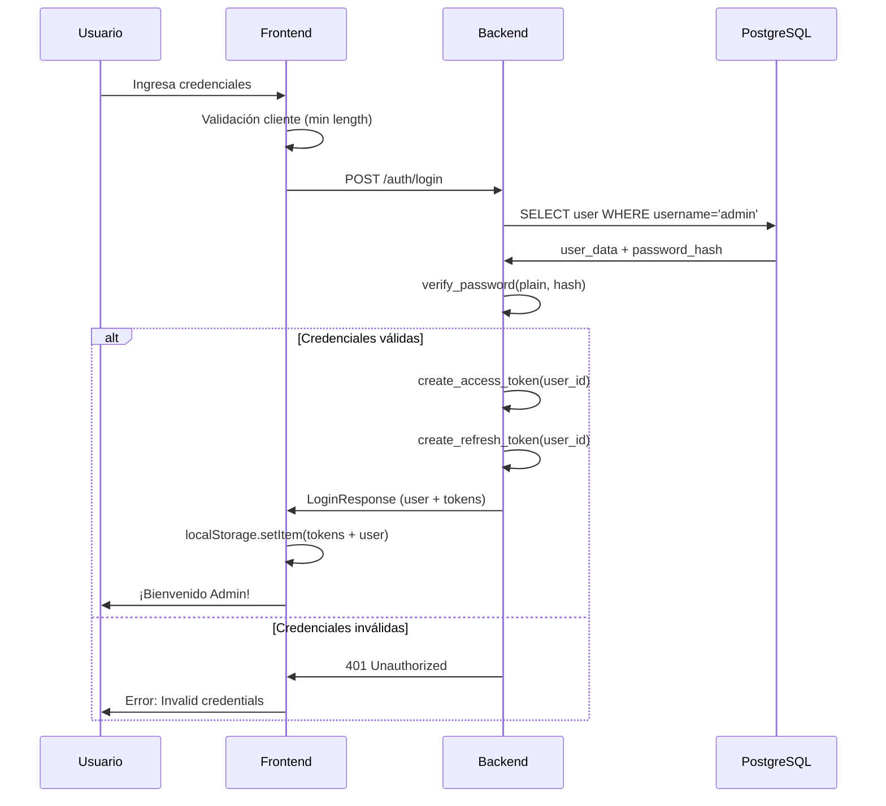

# 🔐 Sistema de Autenticación - Frontend MVP

## 📋 Descripción

Implementación del login con autenticación real contra el backend FastAPI de CrediNet V2.

## 🚀 Características

### ✅ Implementado

- **Login Page** con diseño moderno y animaciones
- **Logo de React** rotando como elemento decorativo
- **Conexión real al backend** vía `POST /api/auth/login`
- **Validaciones de formulario** (mínimo 3 caracteres usuario, 6 contraseña)
- **Manejo de errores** con mensajes descriptivos
- **Almacenamiento seguro** de tokens JWT en localStorage
- **Loading states** durante la petición
- **Diseño responsive** (mobile-first)

## 🔑 Credenciales de Prueba

```
Usuario: admin
Contraseña: admin123
```

## 🛠️ Configuración Técnica

### Backend Endpoint

```
POST http://192.168.98.98:8000/api/auth/login
```

**Request Body:**
```json
{
  "username": "admin",
  "password": "admin123"
}
```

**Response (200 OK):**
```json
{
  "user": {
    "id": 2,
    "username": "admin",
    "email": "admin@credinet.com",
    "first_name": "Admin",
    "last_name": "Total",
    "role": {
      "id": 2,
      "name": "administrador",
      "display_name": "Administrador"
    }
  },
  "access_token": "eyJhbGciOiJIUzI1NiIsInR5cCI6IkpXVCJ9...",
  "refresh_token": "eyJhbGciOiJIUzI1NiIsInR5cCI6IkpXVCJ9...",
  "token_type": "bearer"
}
```

**Error (401 Unauthorized):**
```json
{
  "detail": "Invalid credentials"
}
```

### Seguridad

- **Password Hashing**: bcrypt en backend (`$2b$12$...`)
- **Frontend**: Envía contraseña en texto plano (HTTPS asumido)
- **Backend**: Valida con `verify_password()` de bcrypt
- **JWT Tokens**:
  - `access_token`: Expira en 24 horas
  - `refresh_token`: Expira en 7 días
- **Almacenamiento**: localStorage (temporal, para MVP)

## 📁 Estructura de Archivos

```
frontend-mvp/src/
├── pages/
│   └── LoginPage.jsx       # Componente principal del login
├── styles/
│   └── LoginPage.css       # Estilos con gradientes y animaciones
└── App.jsx                 # Renderiza LoginPage
```

## 🎨 Características de Diseño

### Gradientes
- Fondo: `linear-gradient(135deg, #667eea 0%, #764ba2 100%)`
- Botón: Mismo gradiente con hover effect

### Animaciones
- **Logo React**: Rotación infinita 20s
- **Card**: Slide up al cargar (0.4s ease-out)
- **Botón hover**: TranslateY(-2px) con sombra

### Colores
- Primary: `#667eea` (púrpura)
- Success: `#48bb78` (verde)
- Error: `#fc8181` (rojo)
- Text: `#1a202c` (gris oscuro)

## 🧪 Flujo de Autenticación



## 🔄 Próximos Pasos

### 1. Routing (React Router)
```bash
npm install react-router-dom
```

Crear estructura:
- `/login` - Página pública
- `/dashboard` - Página protegida
- `/loans` - Gestión de préstamos
- `/loans/:id/payments` - Detalles del préstamo

### 2. Protected Routes

```jsx
// PrivateRoute.jsx
const PrivateRoute = ({ children }) => {
  const token = localStorage.getItem('access_token');
  return token ? children : <Navigate to="/login" />;
};
```

### 3. Auth Context

```jsx
// AuthContext.jsx
const AuthContext = createContext();

export const AuthProvider = ({ children }) => {
  const [user, setUser] = useState(() => {
    const stored = localStorage.getItem('user');
    return stored ? JSON.parse(stored) : null;
  });

  const login = (userData, tokens) => {
    localStorage.setItem('access_token', tokens.access_token);
    localStorage.setItem('refresh_token', tokens.refresh_token);
    localStorage.setItem('user', JSON.stringify(userData));
    setUser(userData);
  };

  const logout = () => {
    localStorage.removeItem('access_token');
    localStorage.removeItem('refresh_token');
    localStorage.removeItem('user');
    setUser(null);
  };

  return (
    <AuthContext.Provider value={{ user, login, logout }}>
      {children}
    </AuthContext.Provider>
  );
};

export const useAuth = () => useContext(AuthContext);
```

### 4. API Client con Interceptors

```jsx
// api-client.js
const apiClient = {
  async request(endpoint, options = {}) {
    const token = localStorage.getItem('access_token');
    
    const config = {
      ...options,
      headers: {
        'Content-Type': 'application/json',
        ...(token && { Authorization: `Bearer ${token}` }),
        ...options.headers,
      },
    };

    const response = await fetch(`${API_BASE_URL}${endpoint}`, config);
    
    if (response.status === 401) {
      // Token expirado - intentar refresh
      const refreshed = await this.refreshToken();
      if (refreshed) {
        return this.request(endpoint, options); // Reintentar
      } else {
        // Refresh falló - logout
        window.location.href = '/login';
      }
    }

    return response;
  },

  async refreshToken() {
    const refreshToken = localStorage.getItem('refresh_token');
    // Lógica de refresh...
  }
};
```

### 5. Dashboard Page

Crear página de bienvenida con:
- Nombre del usuario autenticado
- Botón de logout
- Navegación a secciones (préstamos, pagos, asociados)
- Resumen de métricas (usar mock API)

### 6. Mejoras de Seguridad

- [ ] Migrar tokens a `httpOnly` cookies (requiere cambio en backend)
- [ ] Implementar CSRF protection
- [ ] Auto-refresh token antes de expirar
- [ ] Session timeout por inactividad
- [ ] Rate limiting en frontend

## 📝 Testing Manual

1. **Caso de éxito**:
   ```
   Usuario: admin
   Password: admin123
   Resultado: ¡Bienvenido Admin! (alert)
   ```

2. **Credenciales inválidas**:
   ```
   Usuario: admin
   Password: wrongpassword
   Resultado: Error (mensaje rojo en UI)
   ```

3. **Validación de formulario**:
   ```
   Usuario: ad (< 3 chars)
   Resultado: HTML5 validation error
   ```

4. **Backend apagado**:
   ```
   Resultado: "Error al conectar con el servidor"
   ```

## 🌐 Acceso

- **Local**: http://localhost:5174/
- **LAN**: http://192.168.98.98:5174/
- **Docker**: http://172.28.0.1:5174/

## 🔍 Debugging

### Ver tokens almacenados
```javascript
// En consola del navegador
console.log('Access Token:', localStorage.getItem('access_token'));
console.log('User Data:', JSON.parse(localStorage.getItem('user')));
```

### Verificar token JWT
Copiar `access_token` y pegar en https://jwt.io

Verás payload:
```json
{
  "sub": "2",  // user_id
  "exp": 1699999999,  // timestamp expiración
  "iat": 1699900000   // timestamp creación
}
```

## 📚 Referencias

- **Backend Auth Module**: `/backend/app/modules/auth/`
- **Security Utils**: `/backend/app/core/security.py`
- **User Seeds**: `/db/v2.0/modules/09_seeds.sql` (línea 179)
- **Password Hash**: `$2b$12$aSMdt0Kd8I2lrCIvSNbxx.X5U.BmY9MAZAoPvM/MgK5mXOxQgq0s6`

---

**Última actualización**: 2025-11-09  
**Estado**: ✅ Implementado y funcional  
**Backend**: ✅ Running on :8000 (verified with docker ps)
